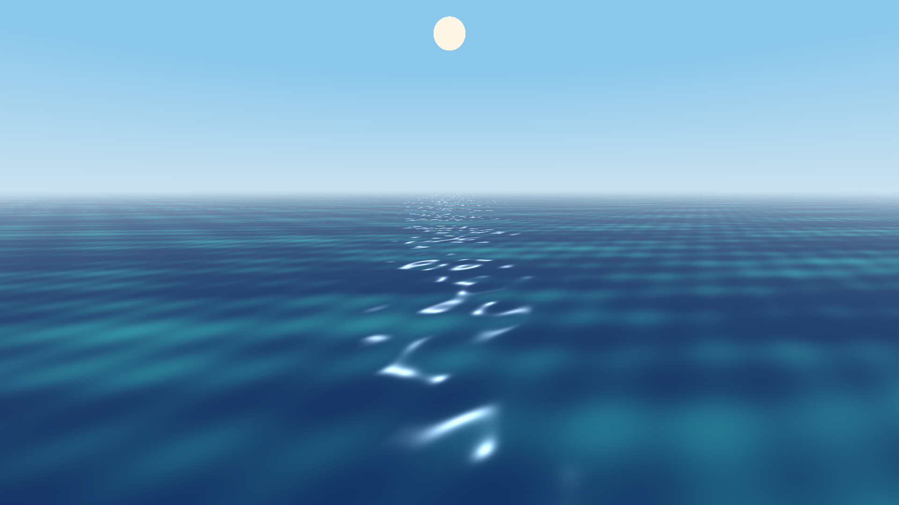
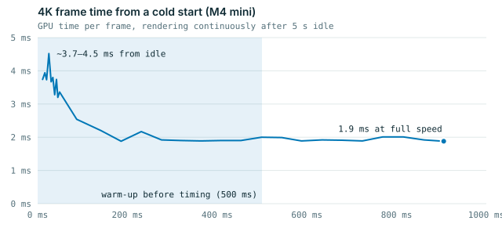
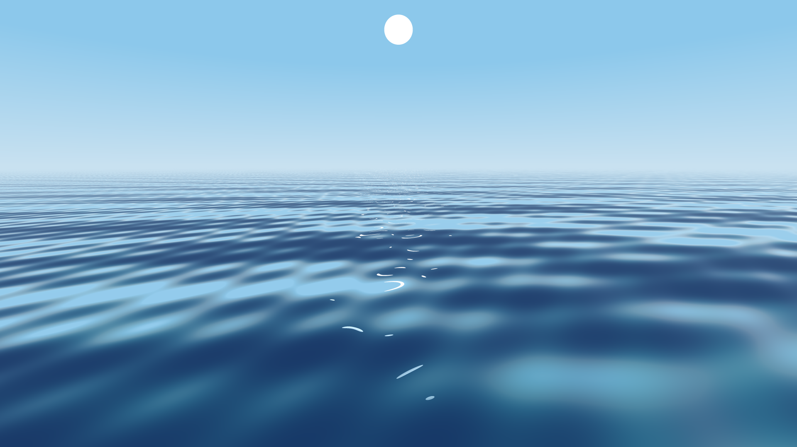
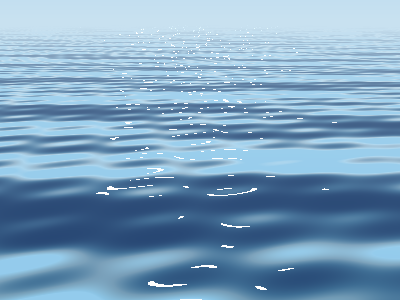
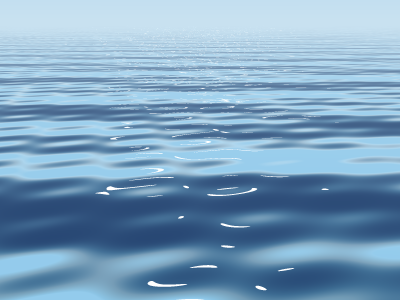
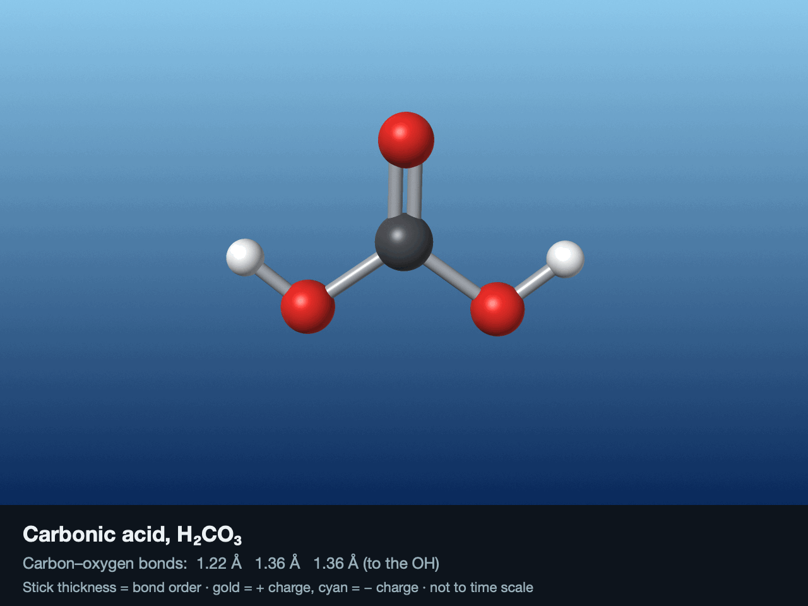
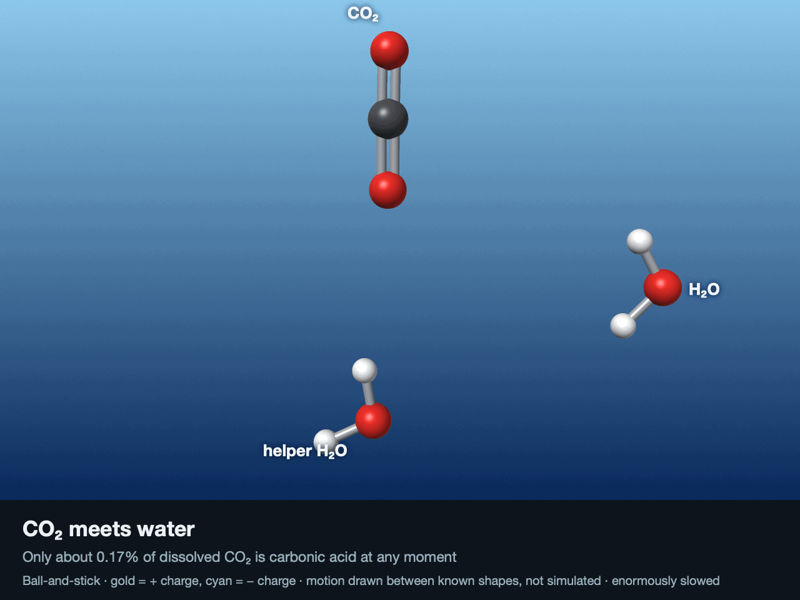
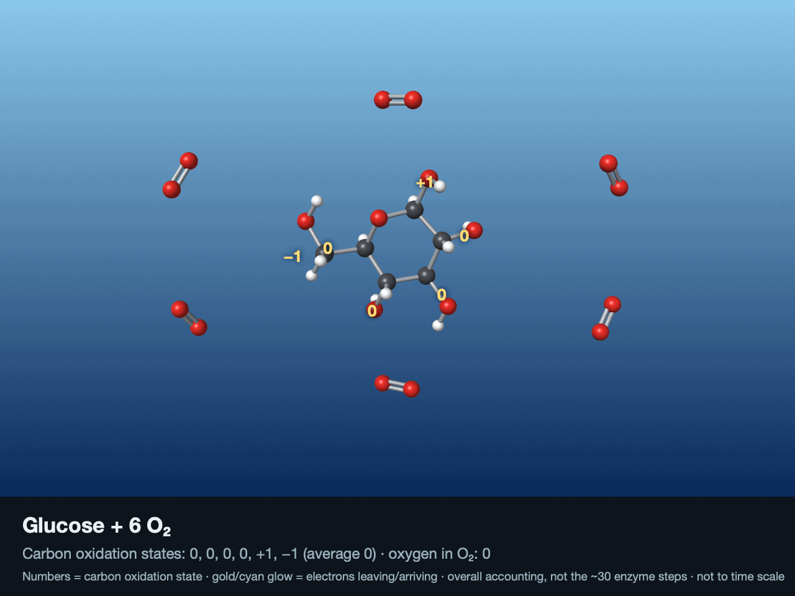
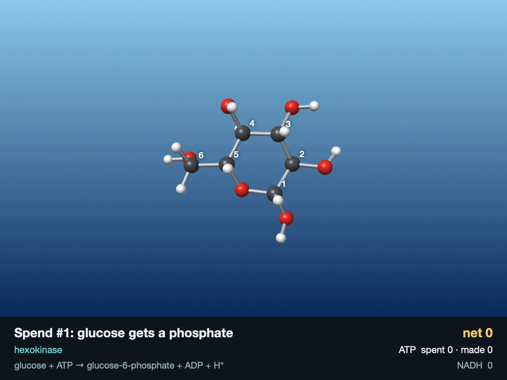
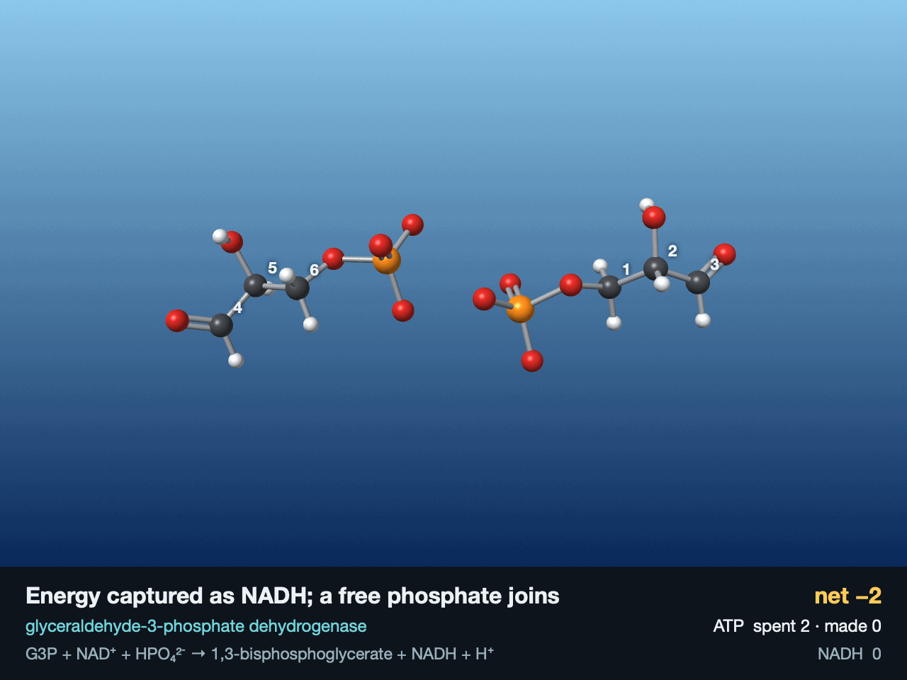

# render_brine

Learning to render water on Apple silicon GPUs with Metal, one small step at a time.

Two Macs take part: an **M4 Mac mini** (10 GPU cores, 16 GB), where the code is written and first run, and an **M3 Max laptop** (40 GPU cores, 48 GB). Steps 1–5 ran on both.

## Showcase

### Step 1: What the two GPUs report

The first program asks each Mac's GPU what it can do. The two chips share the same GPU design, and the M3 Max has more of it. Code: [`step1_hello_gpu/`](step1_hello_gpu/)

| | M4 Mac mini | M3 Max |
|---|---|---|
| GPU cores | 10 | 40 |
| Memory, shared by CPU and GPU | 16 GB | 48 GB |
| Memory the GPU may use | 11.8 GB (74%) | 36.0 GB (75%) |
| SIMD group width (≈ CUDA warp) | 32 | 32 |
| Threadgroup memory (≈ CUDA shared memory) | 32 KB | 32 KB |
| Apple GPU family | Apple 9 | Apple 9 |

### Step 2: Gradient painted on the GPU

The first image painted on the GPU: one thread per pixel, written into memory the CPU and GPU share, so saving it needed no copying. Code: [`step2_paint_gpu/`](step2_paint_gpu/)

### Step 3: Sine-wave ocean with sun

Each of the 2,073,600 pixels gets its own GPU thread. The thread adds up five sine waves to find which way the sea's surface tilts at that spot, then shades it toward the sun, from deep blue to turquoise with white glints. Code: [`step3_water/`](step3_water/)

Both images are 1920 × 1080. The ones shown were rendered on the M4 Mac mini; the M3 Max laptop produced the same gradient exactly and a water image differing in 73 of 2 million pixels, each by 1 level out of 255.

### Step 4: How fast the water renders

The step 3 water render, timed on the GPU's own clock (median of 20 runs) on both Macs. Code: [`step4_timing/`](step4_timing/)

| Size | Pixels | M4 Mac mini (10 GPU cores) | M3 Max laptop (40 GPU cores) | Speedup |
|---|---|---|---|---|
| 256 × 144 | 36,864 | 0.013 ms | 0.010 ms | 1.3× |
| 1080p | 2,073,600 | 0.49 ms | 0.151 ms | 3.2× |
| 4K | 8,294,400 | 1.9 ms | 0.563 ms | 3.4× |

**4× the cores gave about 3.3×, not 4×.** The chips also differ in GPU clock speed and core generation, so core count alone doesn't set the speed. Small jobs barely speed up at all: a tiny image can't keep either GPU busy.

On the mini, 4K has 4× the pixels of 1080p and took 4× the time. Getting steady numbers first required warming the GPU up, because it runs slowly until it's been kept busy for about 200 ms:

### Step 5: The sea mirrors the sky

Each water pixel now bounces its ray off the waves and looks up the sky in that direction. How much it reflects depends on the angle (the Fresnel effect): about 2% looking straight down, nearly everything at a glancing angle. Each pixel also averages 16 samples, which turns the sparkly noise near the horizon into smooth ripples. Code: [`step5_reflections/`](step5_reflections/)

| 1 sample per pixel | 16 samples per pixel |
|---|---|
|  |  |

1080p, median GPU time of 10 runs:

| Samples per pixel | M4 Mac mini | M3 Max laptop | Speedup |
|---|---|---|---|
| 1 | 0.55 ms | 0.169 ms | 3.3× |
| 4 | 1.78 ms | 0.545 ms | 3.3× |
| 16 | 6.61 ms | 2.038 ms | 3.2× |

On both Macs, 16 samples per pixel took only 12× the time of 1 sample, because part of each pixel's cost doesn't grow with its sample count.

### Step 6a: One carbonic acid molecule splits

H₂CO₃ → H⁺ + HCO₃⁻, ray-traced on the GPU with real bond lengths. Code: [`step6_carbonic_acid/step6a_carbonic_acid/molecule/`](step6_carbonic_acid/step6a_carbonic_acid/molecule/)

### Step 6b: The carbonic acid journey

CO₂ + H₂O → H₂CO₃ → HCO₃⁻ + H₃O⁺, one molecule at a time. Code: [`step6_carbonic_acid/step6b_carbonic_journey/`](step6_carbonic_acid/step6b_carbonic_journey/)

### Step 7: Glucose meets oxygen

C₆H₁₂O₆ + 6 O₂ → 6 CO₂ + 6 H₂O, the overall accounting of cellular respiration: 24 electrons move from carbon to oxygen. Code: [`step7_glucose/step7_respiration/`](step7_glucose/step7_respiration/)

### Step 7a: Glycolysis: spend two, earn four

glucose + 2 NAD⁺ + 2 ADP + 2 Pᵢ → 2 pyruvate + 2 NADH + 2 H⁺ + 2 ATP + 2 H₂O. Code: [`step7_glucose/step7a_glycolysis/`](step7_glucose/step7a_glycolysis/)
