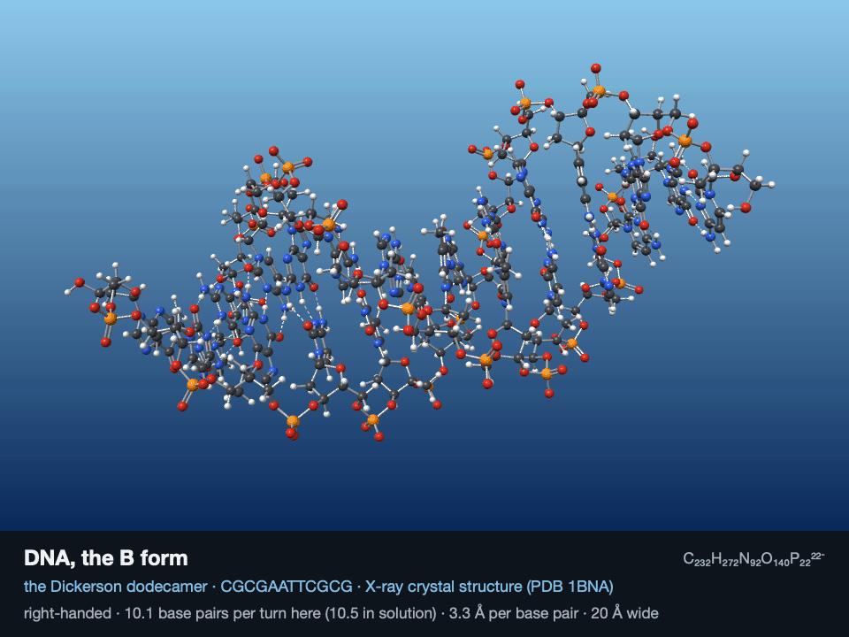
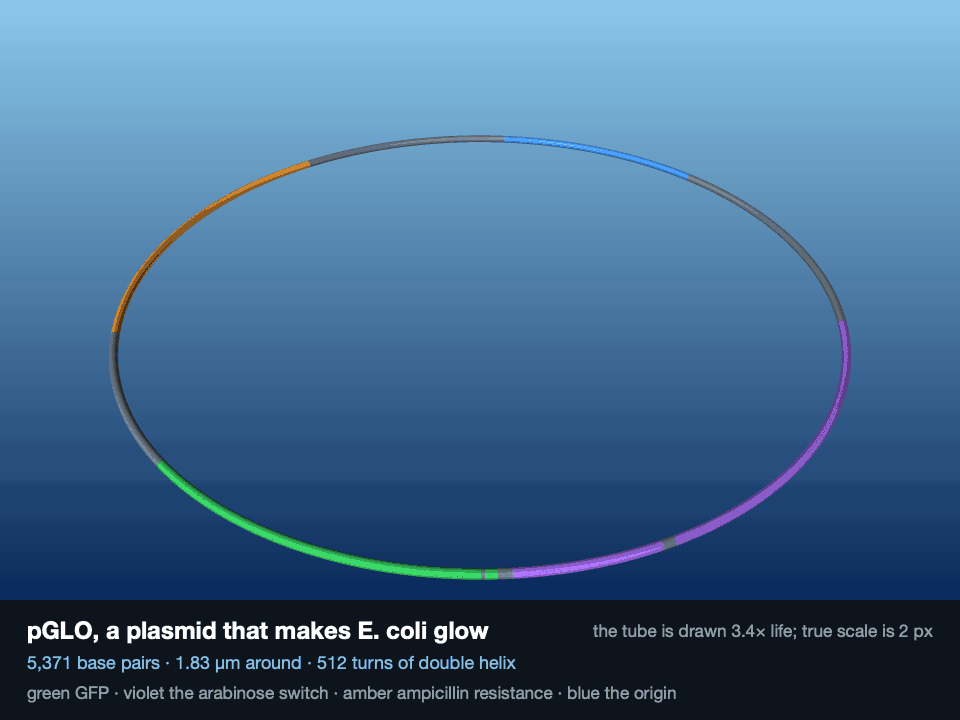
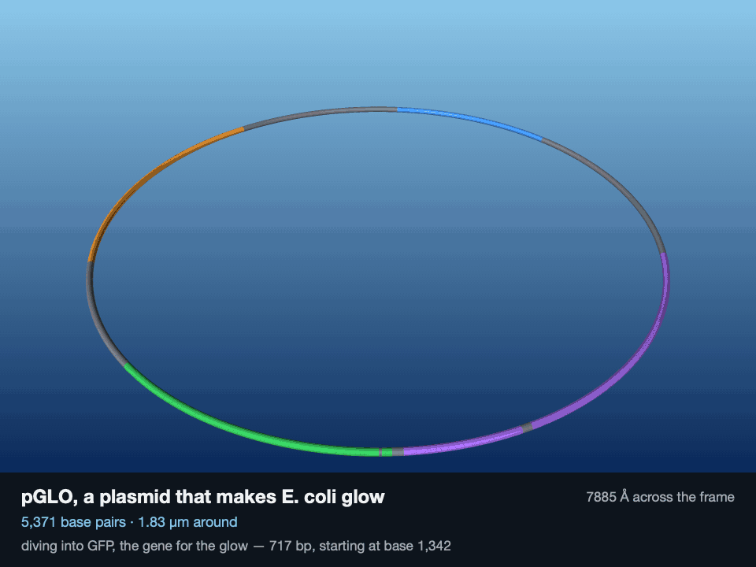
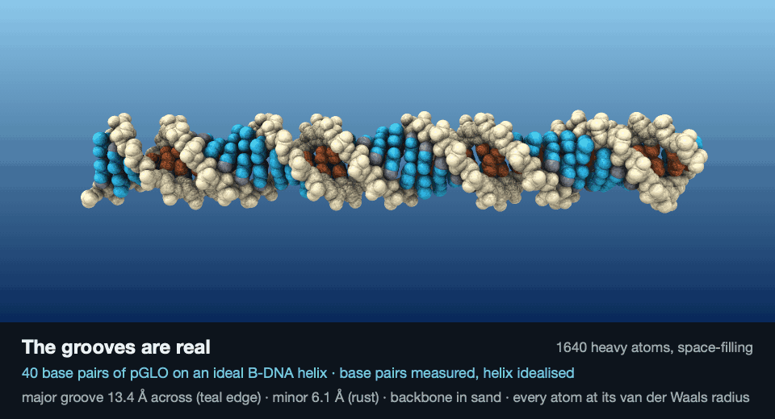
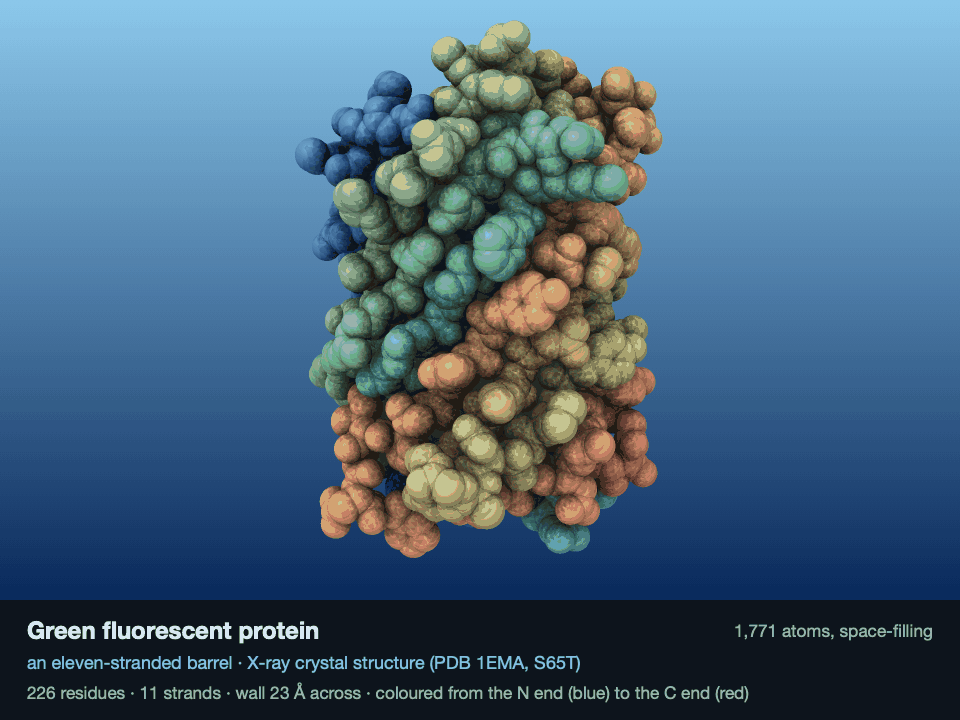
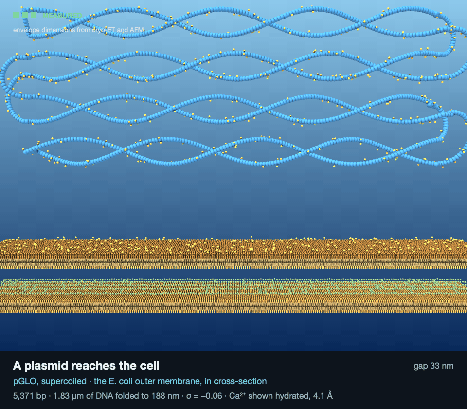
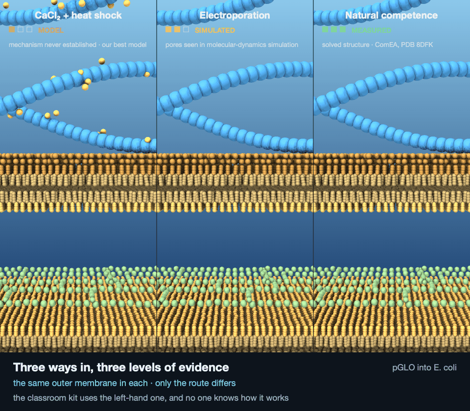

# render_brine

Learning Apple silicon GPUs with Metal, one small step at a time: from ray-traced water to scientifically accurate renders of the chemistry of life, building toward a brine shrimp.

Two Macs take part: an **M4 Mac mini** (10 GPU cores, 16 GB), where the code is written and first run, and an **M3 Max laptop** (40 GPU cores, 48 GB). Steps 1–5 ran on both.

## Showcase

### Step 1: What the two GPUs report

The first program asks each Mac's GPU what it can do. The two chips share the same GPU design, and the M3 Max has more of it. Code: [`step001_hello_gpu/`](step001_hello_gpu/)

| | M4 Mac mini | M3 Max |
|---|---|---|
| GPU cores | 10 | 40 |
| Memory, shared by CPU and GPU | 16 GB | 48 GB |
| Memory the GPU may use | 11.8 GB (74%) | 36.0 GB (75%) |
| SIMD group width (≈ CUDA warp) | 32 | 32 |
| Threadgroup memory (≈ CUDA shared memory) | 32 KB | 32 KB |
| Apple GPU family | Apple 9 | Apple 9 |

### Step 2: Gradient painted on the GPU

The first image painted on the GPU: one thread per pixel, written into memory the CPU and GPU share, so saving it needed no copying. Code: [`step002_paint_gpu/`](step002_paint_gpu/)

### Step 3: Sine-wave ocean with sun

Each of the 2,073,600 pixels gets its own GPU thread. The thread adds up five sine waves to find which way the sea's surface tilts at that spot, then shades it toward the sun, from deep blue to turquoise with white glints. Code: [`step003_water/`](step003_water/)

Both images are 1920 × 1080. The ones shown were rendered on the M4 Mac mini; the M3 Max laptop produced the same gradient exactly and a water image differing in 73 of 2 million pixels, each by 1 level out of 255.

### Step 4: How fast the water renders

The step 3 water render, timed on the GPU's own clock (median of 20 runs) on both Macs. Code: [`step004_timing/`](step004_timing/)

| Size | Pixels | M4 Mac mini (10 GPU cores) | M3 Max laptop (40 GPU cores) | Speedup |
|---|---|---|---|---|
| 256 × 144 | 36,864 | 0.013 ms | 0.010 ms | 1.3× |
| 1080p | 2,073,600 | 0.49 ms | 0.151 ms | 3.2× |
| 4K | 8,294,400 | 1.9 ms | 0.563 ms | 3.4× |

**4× the cores gave about 3.3×, not 4×.** The chips also differ in GPU clock speed and core generation, so core count alone doesn't set the speed. Small jobs barely speed up at all: a tiny image can't keep either GPU busy.

On the mini, 4K has 4× the pixels of 1080p and took 4× the time. Getting steady numbers first required warming the GPU up, because it runs slowly until it's been kept busy for about 200 ms:

### Step 5: The sea mirrors the sky

Each water pixel now bounces its ray off the waves and looks up the sky in that direction. How much it reflects depends on the angle (the Fresnel effect): about 2% looking straight down, nearly everything at a glancing angle. Each pixel also averages 16 samples, which turns the sparkly noise near the horizon into smooth ripples. Code: [`step005_reflections/`](step005_reflections/)

| 1 sample per pixel | 16 samples per pixel |
|---|---|
|  |  |

1080p, median GPU time of 10 runs:

| Samples per pixel | M4 Mac mini | M3 Max laptop | Speedup |
|---|---|---|---|
| 1 | 0.55 ms | 0.169 ms | 3.3× |
| 4 | 1.78 ms | 0.545 ms | 3.3× |
| 16 | 6.61 ms | 2.038 ms | 3.2× |

On both Macs, 16 samples per pixel took only 12× the time of 1 sample, because part of each pixel's cost doesn't grow with its sample count.

### Step 6a: One carbonic acid molecule splits

H₂CO₃ → H⁺ + HCO₃⁻, ray-traced on the GPU with real bond lengths. Code: [`step006_carbonic_acid/step006a_carbonic_acid/molecule/`](step006_carbonic_acid/step006a_carbonic_acid/molecule/)

### Step 6b: The carbonic acid journey

CO₂ + H₂O → H₂CO₃ → HCO₃⁻ + H₃O⁺, one molecule at a time. Code: [`step006_carbonic_acid/step006b_carbonic_journey/`](step006_carbonic_acid/step006b_carbonic_journey/)

### Step 7: Glucose meets oxygen

C₆H₁₂O₆ + 6 O₂ → 6 CO₂ + 6 H₂O, the overall accounting of cellular respiration: 24 electrons move from carbon to oxygen. Code: [`step007_glucose/step007_respiration/`](step007_glucose/step007_respiration/)

### Step 7a: Glycolysis: spend two, earn four

glucose + 2 NAD⁺ + 2 ADP + 2 Pᵢ → 2 pyruvate + 2 NADH + 2 H⁺ + 2 ATP + 2 H₂O. Code: [`step007_glucose/step007a_glycolysis/`](step007_glucose/step007a_glycolysis/)

### Step 8: DNA, slowly turning

The Dickerson–Drew dodecamer, CGCGAATTCGCG, from its X-ray crystal structure ([PDB 1BNA](https://www.rcsb.org/structure/1BNA)): 758 atoms, right-handed, 10.1 base pairs per turn. Code: [`step008_dna/`](step008_dna/)

### Step 8a: pGLO, whole and up close

The plasmid that makes *E. coli* glow, at its real size: 5,371 base pairs, 1.83 µm around, 512 turns of double helix. The dive changes how it draws the molecule twice on the way down, each time at the distance where the finer detail stops being smaller than a pixel. First acceleration structure in the series: a uniform grid, 369× faster than testing every ray against every shape. Code: [`step008a_plasmid/`](step008a_plasmid/)

### Step 8b: The grooves are real

The same DNA as step 8, drawn space-filling instead of ball-and-stick. Two facts appear that ball-and-stick cannot show: the core of the duplex is packed solid, and the space outside it is not filler — it is the major and minor grooves, and the major groove is where proteins reach in to read the sequence. Measured from the real 1BNA atoms: 78% of the space within 3 Å of the axis is inside an atom, falling to 16% at the rim. The groove widths come out at 11.71 Å and 5.35 Å against published values of 11.7 and 5.7, found by scanning every cross-strand phosphate offset rather than being told where to look. Code: [`step008b_grooves/`](step008b_grooves/)

### Step 9: The protein that makes its own light

GFP from its crystal structure ([PDB 1EMA](https://www.rcsb.org/structure/1EMA)), space-filling: every atom a sphere at its full van der Waals radius. The chromophore inside is not a cofactor — the protein builds it out of three consecutive amino acids of its own chain, and the barrel exists to hold it rigid and keep water away. First render with ambient occlusion, which is what makes a space-filling surface readable at all. Code: [`step009_gfp/`](step009_gfp/)

### Step 9a: GFP compared with mCherry protein

Two barrels of almost the same size and fold, and the single bond that separates green light from red. It isn't refraction — they fluoresce, and a chromophore's colour is set by how far its π electrons can spread. mCherry's run is longer by an acylimine, and that is measurable in the coordinates: the N1–CA1 bond is **1.471 Å** in GFP (a single bond) and **1.305 Å** in mCherry (a double), 0.166 Å apart and far beyond coordinate error. The π system runs 14 atoms in one and 16 in the other. Both proteins wear the colour of the light they actually emit, computed from its wavelength through the CIE 1931 matching functions rather than chosen — and both clip, because no screen can show a pure wavelength. Code: [`step009a_color/`](step009a_color/)

### Step 10: Getting a plasmid into a bacterium

Bacterial transformation, and the first render here whose central event has never been observed: the CaCl₂ and heat-shock method dates to 1970 and its molecular mechanism is still not established. So every frame carries an **evidence bar** saying how well the thing on screen is actually known — measured, simulated, or model — and the tests enforce it, failing if the chemical route ever claims more evidence than it has. 407,000 spheres at 20 ms a frame, with the grid rebuilt every frame. Code: [`step010_transformation/`](step010_transformation/)

### Step 11: Arabinose, the sugar that switches on pGLO's gene in E. coli

How pGLO's GFP gene gets switched on. AraC holds *araO2* and *araI1* — 210 base pairs apart — at the same time, tying the DNA in a loop that blocks RNA polymerase. Arabinose binds, AraC's grip moves to the adjacent site, the loop opens, and the gene can be read. The two half-sites occur in pGLO verbatim, and araO2 placed by its published offset lands exactly 210 bp away, independently. First scene here that genuinely deforms, so the acceleration grid is rebuilt every frame — which costs only 7.7% of it. Code: [`step011_switch/`](step011_switch/)

### Step 12: Bacteriophage infecting E. coli

A T4 phage lands on *E. coli* and fires. Both ends of the movement are solved structures — [PDB 5IV5](https://www.rcsb.org/structure/5IV5) hexagonal before attachment, [5IV7](https://www.rcsb.org/structure/5IV7) star-shaped after — so only the path between them is interpolated, which makes this the best-evidenced moving part the project has rendered. 5IV7 turns out to be a strict subset of 5IV5, and "hubless" in its title is literal: after firing the hub is no longer *in* the baseplate, because it has been driven into the cell. The missing half of the file is the event. Measured from the coordinates rather than quoted: the baseplate spreads 49.0 → 60.9 nm and flattens 275 → 151 Å, while the sheath contracts 206 → 130 Å. At 613,332 spheres this is the largest scene here, with the grid rebuilt every frame — 9,625× faster than testing every ray against every sphere, and the first scene where *building* the grid costs more than tracing it, at 44% of the frame. Code: [`step012_phage/`](step012_phage/)

### Step 13: Rendered model of a brine shrimp swimming

*Artemia franciscana*, adult female, about 10 mm. The first render here that stops being a reflected-light renderer. A brightfield micrograph is transmitted light, so the cyan field **is the lamp** — every tone in the animal is light that got through. Instead of shading the nearest hit, each ray now collects every interval it crosses, merges them into a union so that overlapping limbs cannot absorb twice, and returns `background × exp(−τ)`. Colour is nothing but σ per channel: the gut reads olive because its absorption is higher in blue.

The eleven pairs do not beat in unison. Each limb leads the one in front of it by exactly 1/11 of a cycle, so one metachronal wave sits on the body at any instant and the loop closes exactly. The wave runs tail to head — adlocomotory metachrony. One beat does three jobs: the limbs are oars, gills and a filter at once, and algal cells drawn in at the front travel forward along the midventral food groove to the mouth.

At 9.1 µm per pixel a seta is 0.2–0.5 px across and would flicker between frames. Clamping each to a half-pixel floor while scaling σ by the same factor holds the axial optical depth, and the effect was measured rather than asserted: rendering *only* the setae and sliding the camera across one whole pixel in eighths moves the total absorbed light **1.23% at true size and 0.09% clamped**.

The limbs got built wrong first, and the fix is the best thing in the step. A phyllopod is dorsoventrally flattened — flat the way a leaf is flat — and the first version had it flat the other way and the camera off to one side, so eleven pairs of paddles rendered as eleven pairs of slivers with one series hidden behind the other. Correcting it ran into neighbouring limbs passing through each other, and the cause was not what it looked like. Measuring the clearance between adjacent limb axes gives a straight line — 322 µm at the body falling to 42 µm at the tip, slope 2·sin(π/11)·sin A. **A limb has a wedge to live in, not a slot, and a blade of constant width cannot fit a wedge.** The blade now tapers to fit it: 272 µm across at the base, 116 at the tip, and the worst limb-into-limb intrusion is exactly zero. 879 primitives, 7.4 ms a frame — the 9.6 s loop renders in about two seconds. Code: [`step013_swim/`](step013_swim/)

### Step 14: Rendered model of a mysis shrimp swimming

*Mysis diluviana*, the opossum shrimp, the only mysid native to the Great Lakes — and the exact opposite lighting to step 13. That was brightfield; this is **darkfield**, where the direct beam is blocked so it misses the objective entirely and the only light reaching the lens is light the animal scattered. Same ray traversal as step 13, with the other operator plugged into it: absorption becomes emission, and the background goes from a bright lamp to exactly zero. Scattering is deposited where the ray *crosses an interface*, never along a solid interior, because that is where the refractive index jumps — which is why the outlines and the segment joints are the brightest things and the flat middles are dim. The blue-white cast is not a colour choice: small scatterers go as λ⁻⁴, so it falls out of the wavelength exponent.

Two details only a mysid has. The two hard white beads in the tail fan are **statocysts**, balance organs carrying a dense crystal, and they sit in the uropod endopods — the character that diagnoses the whole order. The pouch under the thorax is the **marsupium**, which is why these are called opossum shrimp; this one carries eleven embryos.

**And the render's own premise failed, which is the interesting part.** A frozen camera over a black field should let the changed-pixels-only GIF encoder do what it was built for. Measured: 9.22% of pixels change per frame — but the changed *bounding box* covers 99.7% of the frame, because falling snow scatters its changes everywhere. The encoder stores one rectangle per frame, so it ships a near-full-frame crop every time, and the file came out **larger** than step 13's at 14.3 MB against 6.4. A frozen camera is not enough; the changes also have to be contiguous. The swept bounding volume told the same story: 1.00× over the whole scene, 1.40× over the animal alone. Both numbers are printed by `make run` and pinned by a test so they cannot quietly change. 457 primitives, 6.8 ms a frame. Code: [`step014_mysis/`](step014_mysis/)

### Step 15: A coconut sprouting

The white ball is a **haustorium** — the coconut apple. It is not part of the nut you buy: it is a new organ the embryo grows after germination starts, swelling out of the cotyledon to fill the water cavity while it digests the nut from the inside. That happens in the dark inside a sealed shell, which is the whole argument for a cutaway.

Three things a bean-germination mental model gets wrong, and all three are visible here. A coconut has **no taproot** — it grows an adventitious fan of roughly equal roots. The **shell never cracks**: the shoot leaves through one of the three eyes, the only soft one, and a test asserts the endocarp stays unbroken everywhere else. And the **cotyledon never leaves the shell** — it stays inside and becomes the haustorium.

The budget closes, and not the way the brief guessed. "Endosperm lost equals haustorium gained" cannot be satisfied at all without creating matter, because the haustorium gets most of its bulk from the **coconut water it absorbs**, not from the meat it digests. The real conservation has three terms — solid endosperm + liquid endosperm + haustorium = the volume inside the testa — and it closes to a relative error under 1e-9 at every frame with no efficiency factor. Of the 434 mL the haustorium gains, **109 mL is vacated meat and 325 mL is absorbed water**: the meat is a quarter of it.

First portrait render here, and the first cutaway. Capping the cut faces turned out to be nearly free on top of step 13's ray traversal — take the merged per-material runs, find the one covering the clip plane, shade it as cut, about 25 lines and no second pass. What cost money was what brightfield never needed: surface normals and ambient occlusion, around 40% of the frame. Growth is one-way, so the loop holds on the finished seedling and cross-dissolves back to the dormant nut rather than ever running backwards. 412 primitives, 24.3 ms a frame. Code: [`step015_coconut/`](step015_coconut/)

### Step 17: Lactose cut into glucose and galactose

The enzyme in your gut is lactase-phlorizin hydrolase, and **no structure of it has ever been deposited** — no crystal structure, no cryo-EM map. Rendering it would mean rendering a prediction, so this renders *E. coli* β-galactosidase instead, with the organism named on the frame. That is the same enzyme LacZ makes: the reporter gene, sibling to GFP in step 9.

Two glutamates do everything. **Glu537** attacks the anomeric carbon while **Glu461**, acting as an acid, protonates the bridging oxygen so glucose can leave — and what remains is the sugar bonded to the protein. Then Glu461 switches to base, deprotonates a water, and the water breaks the bond. Each step inverts the anomeric centre, so **two inversions make a retention**: the galactose that comes out is the same way round as the one that went in.

And that is not animated, it is measured. Signed volume at the galactosyl carbon, straight from three deposited structures: **1JYN +2.482 (β) → 1JZ2 −1.864 (α) → 1JZ7 +2.430 (β)**. The middle one is not a mimic — [1JZ2](https://www.rcsb.org/structure/1JZ2) is the covalent galactosyl–enzyme intermediate itself, trapped and solved at 2.1 Å with its C1–OE2 bond measuring 1.447 Å.

Better still, the render is constrained by what the data *cannot* say. The noise floor was taken from the four crystallographically independent copies inside each entry — same data, same refinement, so their disagreement is noise — and every state-to-state difference in the protein came out **below** it. So no protein atom moves in this render at all, and a test fails the build if that stops being true. The ligand clears the floor easily: 2.73 Å between binding sites against 0.10–0.42 Å within them. One state is missing from the world's structures and is labelled model accordingly — the true Michaelis complex, with substrate in the deep site, is the one nobody has caught. 32,535 heavy atoms, 58 ms a frame, 231× through the grid. Code: [`step017_lactase/`](step017_lactase/)

### Step 18: Sucrose cut into glucose and fructose

Invertase does not invert anything at the anomeric centre. Like β-galactosidase in step 17 it is a *retaining* enzyme — two inversions, net retention. **The inversion in its name is the optical rotation of the whole solution**, and it is macroscopic: sucrose turns polarised light right at +66.5°, and the glucose-and-fructose mixture it becomes turns it left, because fructose at −92.4° outweighs glucose at +52.7° by nearly two to one.

So the render has two panels, and the second is the point: nobody ever saw the chemistry happen. They watched a number go negative in a polarimeter and reasoned backwards. The dial is computed by counting the molecules actually drawn in the cell and measuring the beam's twist back off the rendered geometry — the two panels agree to better than **0.02°** across every frame.

The arithmetic has a wrinkle that usually gets dropped. Hydrolysis **takes up a water**, so a gram of sucrose becomes 1.0526 g of invert sugar and the observed rotation climbs with the concentration: a fully inverted cell reads −0.314 of the fresh one, not −19.9/66.5 = −0.298. Which gives the fact the dial is built around — **the sign flips at 76.1% converted, not at half**, because sucrose starts a long way positive and the products only end a little way negative.

Two traps worth recording. The published catalytic residues are *mature-protein* numbers and the crystal is numbered one lower, so the nucleophile called Asp23 in the literature is **Asp22** in [4EQV](https://www.rcsb.org/structure/4EQV) — and residue 23 in the coordinates is a **proline**. Taken literally, the render would have shown a proline doing the chemistry and looked entirely convincing. And the substrate pose is not docked after all: [6S1T](https://www.rcsb.org/structure/6S1T) has sucrose trapped in a related yeast enzyme at 2.09 Å, so it was carried across by superposing the sites at 0.28 Å — after which the attack geometry fell out unaimed at 2.75 Å and 164.0°, a near-perfect in-line trajectory. Hydrolysis is irreversible, so the loop closes on the bench rather than on the chemistry: the cell drains and refills with fresh sucrose, which is what a polarimetrist actually does between runs. Code: [`step018_invertase/`](step018_invertase/)
