# render_brine

Learning Apple silicon GPUs with Metal, one small step at a time: from ray-traced water to scientifically accurate renders of the chemistry of life, building toward a brine shrimp.

Two Macs take part: an **M4 Mac mini** (10 GPU cores, 16 GB), where the code is written and first run, and an **M3 Max laptop** (40 GPU cores, 48 GB). Steps 1–5 ran on both.

## Showcase

### Step 1: What the two GPUs report

The first program asks each Mac's GPU what it can do. The two chips share the same GPU design, and the M3 Max has more of it. Code: [`step001_hello_gpu/`](step001_hello_gpu/)

| | M4 Mac mini | M3 Max |
|---|---|---|
| GPU cores | 10 | 40 |
| Memory, shared by CPU and GPU | 16 GB | 48 GB |
| Memory the GPU may use | 11.8 GB (74%) | 36.0 GB (75%) |
| SIMD group width (≈ CUDA warp) | 32 | 32 |
| Threadgroup memory (≈ CUDA shared memory) | 32 KB | 32 KB |
| Apple GPU family | Apple 9 | Apple 9 |

### Step 2: Gradient painted on the GPU

The first image painted on the GPU: one thread per pixel, written into memory the CPU and GPU share, so saving it needed no copying. Code: [`step002_paint_gpu/`](step002_paint_gpu/)

### Step 3: Sine-wave ocean with sun

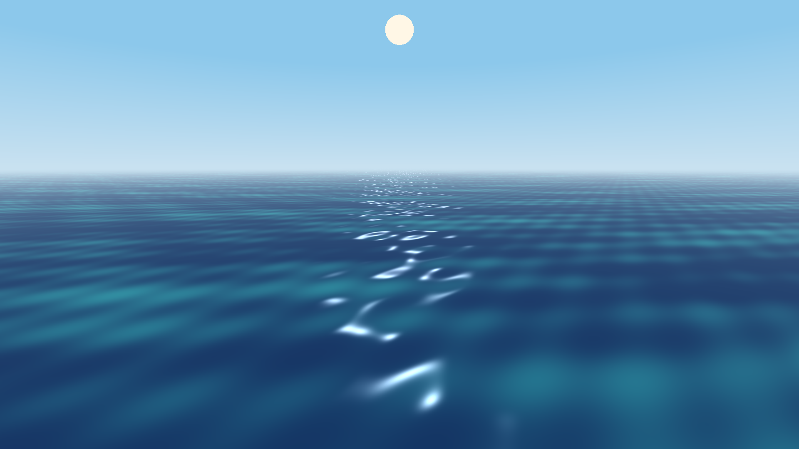

Each of the 2,073,600 pixels gets its own GPU thread. The thread adds up five sine waves to find which way the sea's surface tilts at that spot, then shades it toward the sun, from deep blue to turquoise with white glints. Code: [`step003_water/`](step003_water/)

Both images are 1920 × 1080. The ones shown were rendered on the M4 Mac mini; the M3 Max laptop produced the same gradient exactly and a water image differing in 73 of 2 million pixels, each by 1 level out of 255.

### Step 4: How fast the water renders

The step 3 water render, timed on the GPU's own clock (median of 20 runs) on both Macs. Code: [`step004_timing/`](step004_timing/)

| Size | Pixels | M4 Mac mini (10 GPU cores) | M3 Max laptop (40 GPU cores) | Speedup |
|---|---|---|---|---|
| 256 × 144 | 36,864 | 0.013 ms | 0.010 ms | 1.3× |
| 1080p | 2,073,600 | 0.49 ms | 0.151 ms | 3.2× |
| 4K | 8,294,400 | 1.9 ms | 0.563 ms | 3.4× |

**4× the cores gave about 3.3×, not 4×.** The chips also differ in GPU clock speed and core generation, so core count alone doesn't set the speed. Small jobs barely speed up at all: a tiny image can't keep either GPU busy.

On the mini, 4K has 4× the pixels of 1080p and took 4× the time. Getting steady numbers first required warming the GPU up, because it runs slowly until it's been kept busy for about 200 ms:

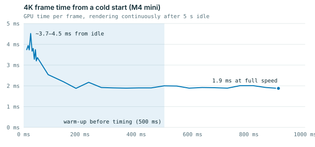

### Step 5: The sea mirrors the sky

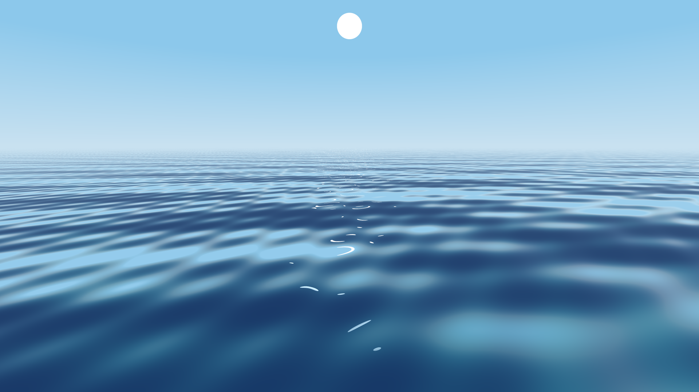

Each water pixel now bounces its ray off the waves and looks up the sky in that direction. How much it reflects depends on the angle (the Fresnel effect): about 2% looking straight down, nearly everything at a glancing angle. Each pixel also averages 16 samples, which turns the sparkly noise near the horizon into smooth ripples. Code: [`step005_reflections/`](step005_reflections/)

| 1 sample per pixel | 16 samples per pixel |
|---|---|
| 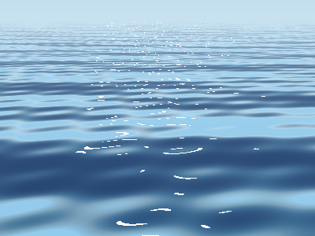 | 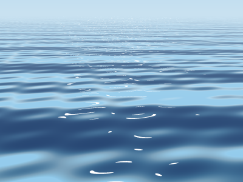 |

1080p, median GPU time of 10 runs:

| Samples per pixel | M4 Mac mini | M3 Max laptop | Speedup |
|---|---|---|---|
| 1 | 0.55 ms | 0.169 ms | 3.3× |
| 4 | 1.78 ms | 0.545 ms | 3.3× |
| 16 | 6.61 ms | 2.038 ms | 3.2× |

On both Macs, 16 samples per pixel took only 12× the time of 1 sample, because part of each pixel's cost doesn't grow with its sample count.

### Step 6a: One carbonic acid molecule splits

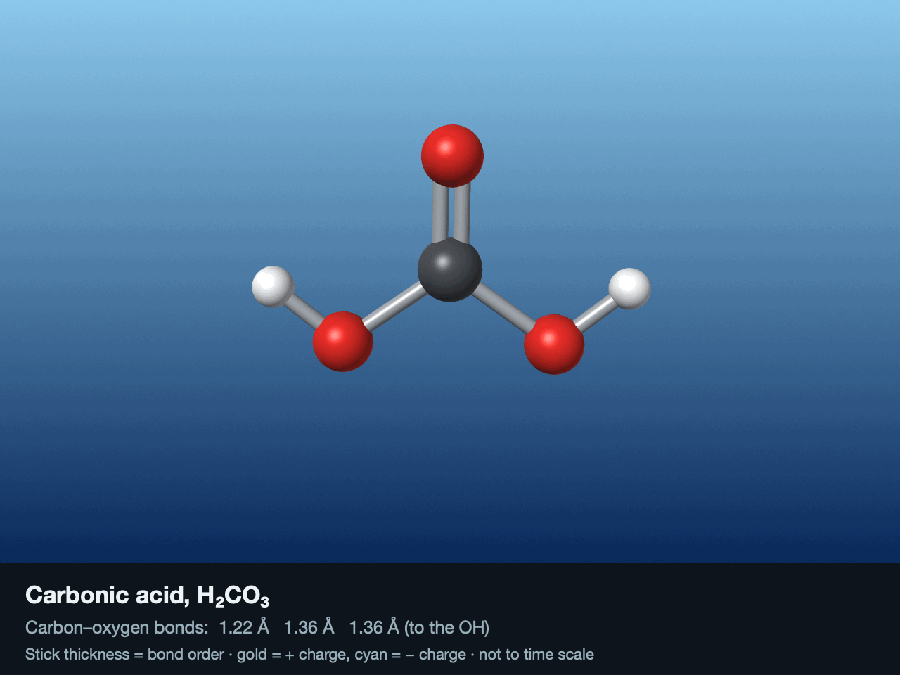

H₂CO₃ → H⁺ + HCO₃⁻, ray-traced on the GPU with real bond lengths. Code: [`step006_carbonic_acid/step006a_carbonic_acid/molecule/`](step006_carbonic_acid/step006a_carbonic_acid/molecule/)

### Step 6b: The carbonic acid journey

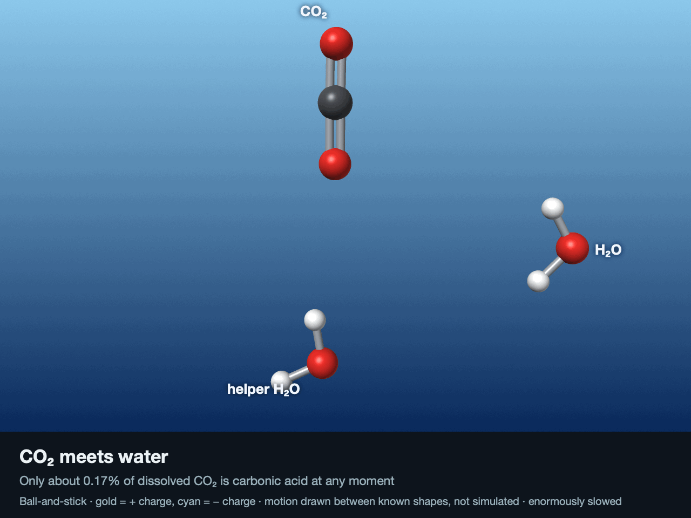

CO₂ + H₂O → H₂CO₃ → HCO₃⁻ + H₃O⁺, one molecule at a time. Code: [`step006_carbonic_acid/step006b_carbonic_journey/`](step006_carbonic_acid/step006b_carbonic_journey/)

### Step 7: Glucose meets oxygen

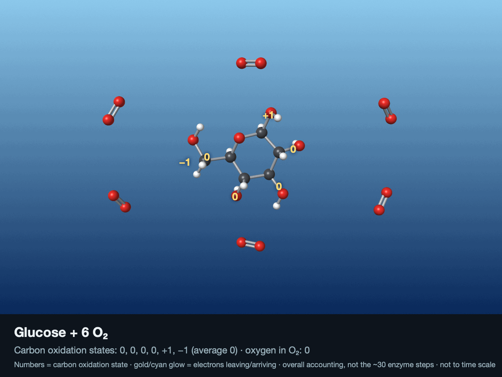

C₆H₁₂O₆ + 6 O₂ → 6 CO₂ + 6 H₂O, the overall accounting of cellular respiration: 24 electrons move from carbon to oxygen. Code: [`step007_glucose/step007_respiration/`](step007_glucose/step007_respiration/)

### Step 7a: Glycolysis: spend two, earn four

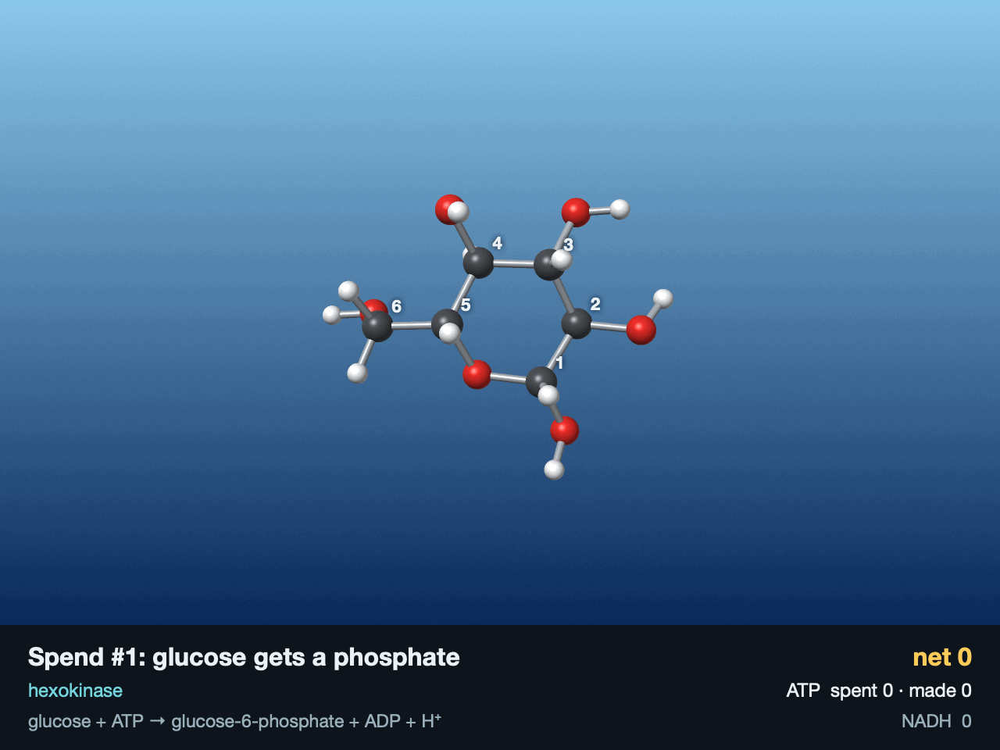

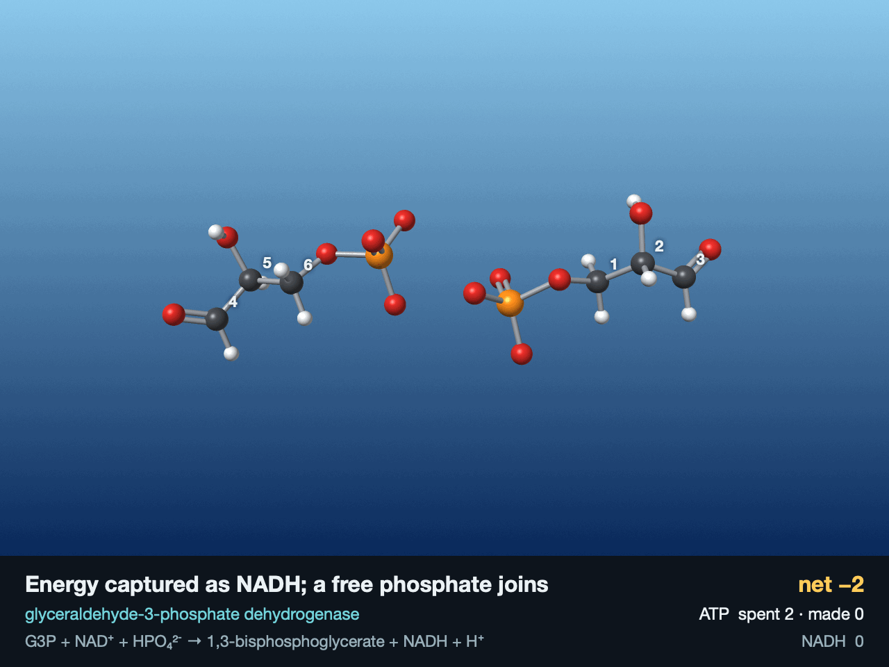

glucose + 2 NAD⁺ + 2 ADP + 2 Pᵢ → 2 pyruvate + 2 NADH + 2 H⁺ + 2 ATP + 2 H₂O. Code: [`step007_glucose/step007a_glycolysis/`](step007_glucose/step007a_glycolysis/)

### Step 8: DNA, slowly turning

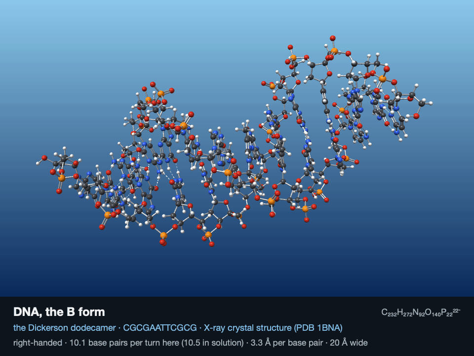

The Dickerson–Drew dodecamer, CGCGAATTCGCG, from its X-ray crystal structure ([PDB 1BNA](https://www.rcsb.org/structure/1BNA)): 758 atoms, right-handed, 10.1 base pairs per turn. Code: [`step008_dna/`](step008_dna/)

### Step 8a: pGLO, whole and up close

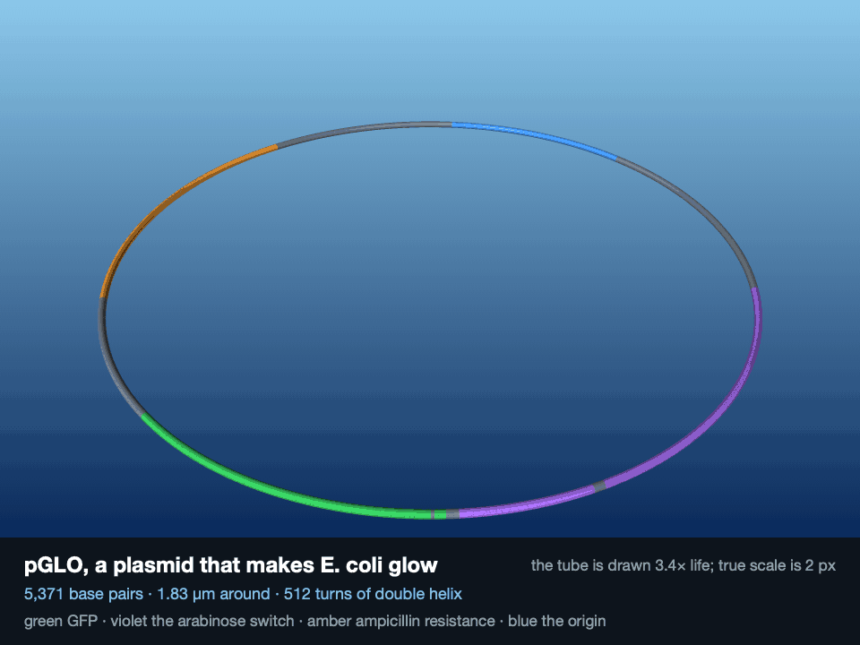

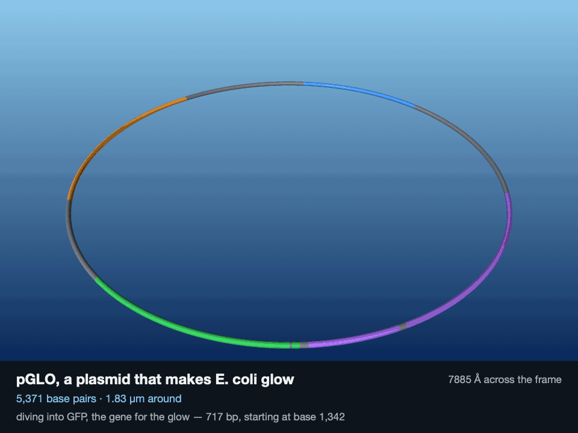

The plasmid that makes *E. coli* glow, at its real size: 5,371 base pairs, 1.83 µm around, 512 turns of double helix. The dive changes how it draws the molecule twice on the way down, each time at the distance where the finer detail stops being smaller than a pixel. First acceleration structure in the series: a uniform grid, 369× faster than testing every ray against every shape. Code: [`step008a_plasmid/`](step008a_plasmid/)

### Step 8b: The grooves are real

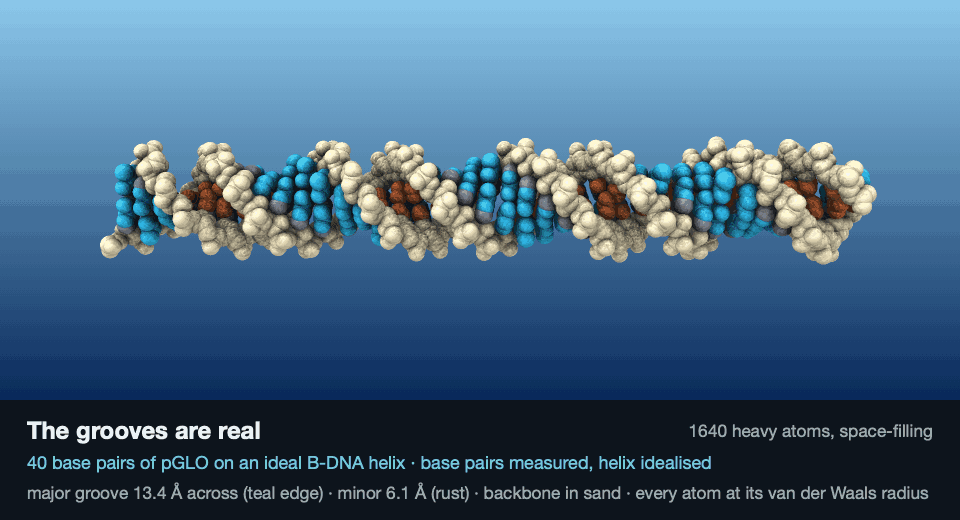

The same DNA as step 8, drawn space-filling instead of ball-and-stick. Two facts appear that ball-and-stick cannot show: the core of the duplex is packed solid, and the space outside it is not filler — it is the major and minor grooves, and the major groove is where proteins reach in to read the sequence. Measured from the real 1BNA atoms: 78% of the space within 3 Å of the axis is inside an atom, falling to 16% at the rim. The groove widths come out at 11.71 Å and 5.35 Å against published values of 11.7 and 5.7, found by scanning every cross-strand phosphate offset rather than being told where to look. Code: [`step008b_grooves/`](step008b_grooves/)

### Step 9: The protein that makes its own light

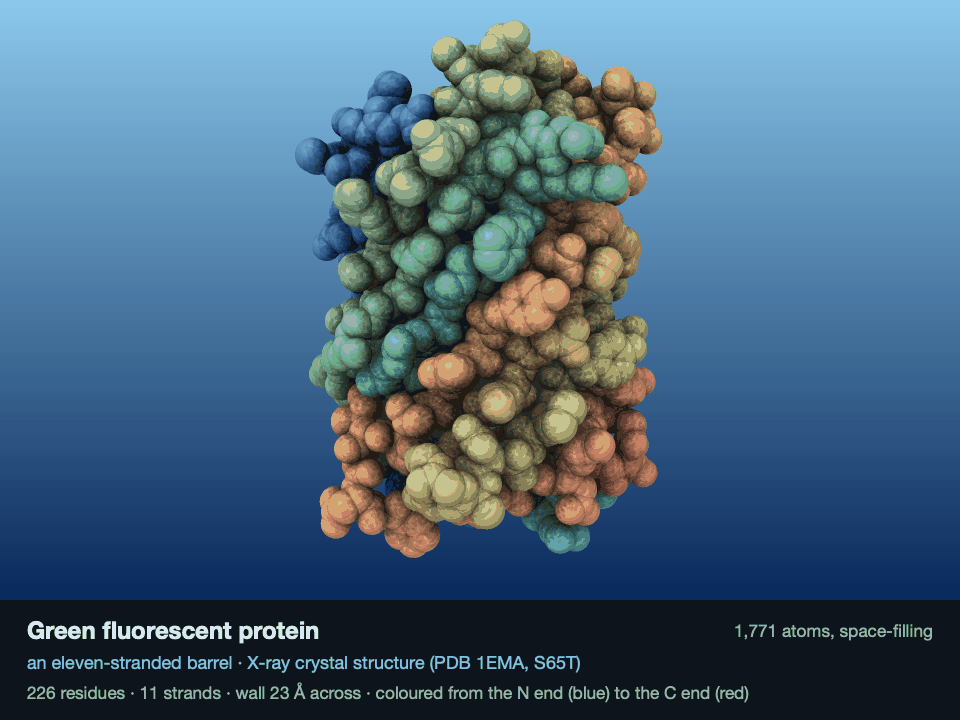

GFP from its crystal structure ([PDB 1EMA](https://www.rcsb.org/structure/1EMA)), space-filling: every atom a sphere at its full van der Waals radius. The chromophore inside is not a cofactor — the protein builds it out of three consecutive amino acids of its own chain, and the barrel exists to hold it rigid and keep water away. First render with ambient occlusion, which is what makes a space-filling surface readable at all. Code: [`step009_gfp/`](step009_gfp/)

### Step 9a: GFP compared with mCherry protein

Two barrels of almost the same size and fold, and the single bond that separates green light from red. It isn't refraction — they fluoresce, and a chromophore's colour is set by how far its π electrons can spread. mCherry's run is longer by an acylimine, and that is measurable in the coordinates: the N1–CA1 bond is **1.471 Å** in GFP (a single bond) and **1.305 Å** in mCherry (a double), 0.166 Å apart and far beyond coordinate error. The π system runs 14 atoms in one and 16 in the other. Both proteins wear the colour of the light they actually emit, computed from its wavelength through the CIE 1931 matching functions rather than chosen — and both clip, because no screen can show a pure wavelength. Code: [`step009a_color/`](step009a_color/)

### Step 10: Getting a plasmid into a bacterium

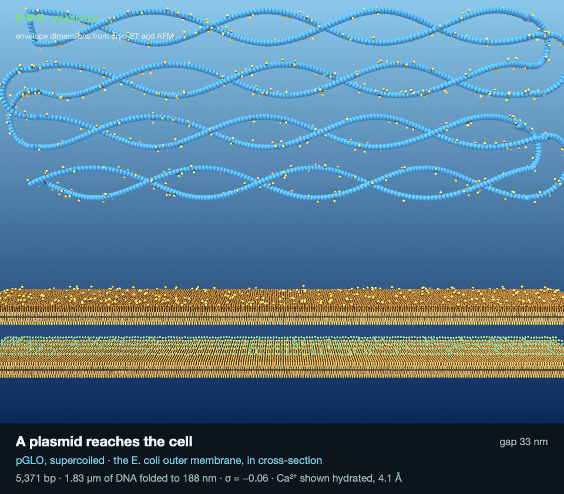

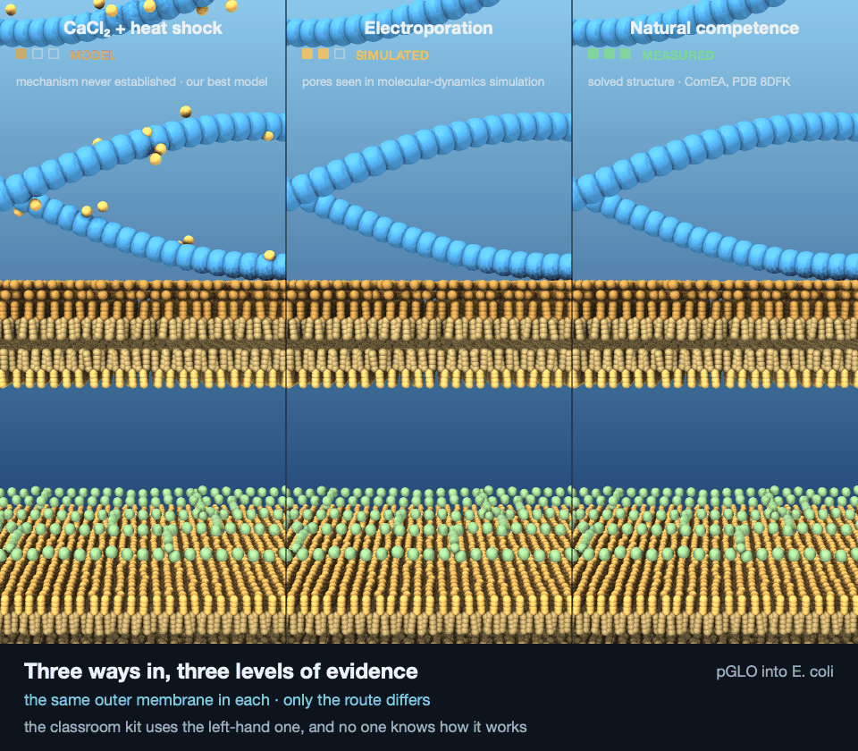

Bacterial transformation, and the first render here whose central event has never been observed: the CaCl₂ and heat-shock method dates to 1970 and its molecular mechanism is still not established. So every frame carries an **evidence bar** saying how well the thing on screen is actually known — measured, simulated, or model — and the tests enforce it, failing if the chemical route ever claims more evidence than it has. 407,000 spheres at 20 ms a frame, with the grid rebuilt every frame. Code: [`step010_transformation/`](step010_transformation/)

### Step 11: Arabinose, the sugar that switches on pGLO's gene in E. coli

How pGLO's GFP gene gets switched on. AraC holds *araO2* and *araI1* — 210 base pairs apart — at the same time, tying the DNA in a loop that blocks RNA polymerase. Arabinose binds, AraC's grip moves to the adjacent site, the loop opens, and the gene can be read. The two half-sites occur in pGLO verbatim, and araO2 placed by its published offset lands exactly 210 bp away, independently. First scene here that genuinely deforms, so the acceleration grid is rebuilt every frame — which costs only 7.7% of it. Code: [`step011_switch/`](step011_switch/)

### Step 12: Bacteriophage infecting E. coli

A T4 phage lands on *E. coli* and fires. Both ends of the movement are solved structures — [PDB 5IV5](https://www.rcsb.org/structure/5IV5) hexagonal before attachment, [5IV7](https://www.rcsb.org/structure/5IV7) star-shaped after — so only the path between them is interpolated, which makes this the best-evidenced moving part the project has rendered. 5IV7 turns out to be a strict subset of 5IV5, and "hubless" in its title is literal: after firing the hub is no longer *in* the baseplate, because it has been driven into the cell. The missing half of the file is the event. Measured from the coordinates rather than quoted: the baseplate spreads 49.0 → 60.9 nm and flattens 275 → 151 Å, while the sheath contracts 206 → 130 Å. At 613,332 spheres this is the largest scene here, with the grid rebuilt every frame — 9,625× faster than testing every ray against every sphere, and the first scene where *building* the grid costs more than tracing it, at 44% of the frame. Code: [`step012_phage/`](step012_phage/)

### Step 13: Rendered model of a brine shrimp swimming

*Artemia franciscana*, adult female, about 10 mm. The first render here that stops being a reflected-light renderer. A brightfield micrograph is transmitted light, so the cyan field **is the lamp** — every tone in the animal is light that got through. Instead of shading the nearest hit, each ray now collects every interval it crosses, merges them into a union so that overlapping limbs cannot absorb twice, and returns `background × exp(−τ)`. Colour is nothing but σ per channel: the gut reads olive because its absorption is higher in blue.

The eleven pairs do not beat in unison. Each limb leads the one in front of it by exactly 1/11 of a cycle, so one metachronal wave sits on the body at any instant and the loop closes exactly. The wave runs tail to head — adlocomotory metachrony. One beat does three jobs: the limbs are oars, gills and a filter at once, and algal cells drawn in at the front travel forward along the midventral food groove to the mouth.

At 9.1 µm per pixel a seta is 0.2–0.5 px across and would flicker between frames. Clamping each to a half-pixel floor while scaling σ by the same factor holds the axial optical depth, and the effect was measured rather than asserted: rendering *only* the setae and sliding the camera across one whole pixel in eighths moves the total absorbed light **1.23% at true size and 0.09% clamped**.

The limbs got built wrong first, and the fix is the best thing in the step. A phyllopod is dorsoventrally flattened — flat the way a leaf is flat — and the first version had it flat the other way and the camera off to one side, so eleven pairs of paddles rendered as eleven pairs of slivers with one series hidden behind the other. Correcting it ran into neighbouring limbs passing through each other, and the cause was not what it looked like. Measuring the clearance between adjacent limb axes gives a straight line — 322 µm at the body falling to 42 µm at the tip, slope 2·sin(π/11)·sin A. **A limb has a wedge to live in, not a slot, and a blade of constant width cannot fit a wedge.** The blade now tapers to fit it: 272 µm across at the base, 116 at the tip, and the worst limb-into-limb intrusion is exactly zero. 879 primitives, 7.4 ms a frame — the 9.6 s loop renders in about two seconds. Code: [`step013_swim/`](step013_swim/)

### Step 14: Rendered model of a mysis shrimp swimming

*Mysis diluviana*, the opossum shrimp, the only mysid native to the Great Lakes — and the exact opposite lighting to step 13. That was brightfield; this is **darkfield**, where the direct beam is blocked so it misses the objective entirely and the only light reaching the lens is light the animal scattered. Same ray traversal as step 13, with the other operator plugged into it: absorption becomes emission, and the background goes from a bright lamp to exactly zero. Scattering is deposited where the ray *crosses an interface*, never along a solid interior, because that is where the refractive index jumps — which is why the outlines and the segment joints are the brightest things and the flat middles are dim. The blue-white cast is not a colour choice: small scatterers go as λ⁻⁴, so it falls out of the wavelength exponent.

Two details only a mysid has. The two hard white beads in the tail fan are **statocysts**, balance organs carrying a dense crystal, and they sit in the uropod endopods — the character that diagnoses the whole order. The pouch under the thorax is the **marsupium**, which is why these are called opossum shrimp; this one carries eleven embryos.

**And the render's own premise failed, which is the interesting part.** A frozen camera over a black field should let the changed-pixels-only GIF encoder do what it was built for. Measured: 9.22% of pixels change per frame — but the changed *bounding box* covers 99.7% of the frame, because falling snow scatters its changes everywhere. The encoder stores one rectangle per frame, so it ships a near-full-frame crop every time, and the file came out **larger** than step 13's at 14.3 MB against 6.4. A frozen camera is not enough; the changes also have to be contiguous. The swept bounding volume told the same story: 1.00× over the whole scene, 1.40× over the animal alone. Both numbers are printed by `make run` and pinned by a test so they cannot quietly change. 457 primitives, 6.8 ms a frame. Code: [`step014_mysis/`](step014_mysis/)

### Step 15: A coconut sprouting

The white ball is a **haustorium** — the coconut apple. It is not part of the nut you buy: it is a new organ the embryo grows after germination starts, swelling out of the cotyledon to fill the water cavity while it digests the nut from the inside. That happens in the dark inside a sealed shell, which is the whole argument for a cutaway.

Three things a bean-germination mental model gets wrong, and all three are visible here. A coconut has **no taproot** — it grows an adventitious fan of roughly equal roots. The **shell never cracks**: the shoot leaves through one of the three eyes, the only soft one, and a test asserts the endocarp stays unbroken everywhere else. And the **cotyledon never leaves the shell** — it stays inside and becomes the haustorium.

The budget closes, and not the way the brief guessed. "Endosperm lost equals haustorium gained" cannot be satisfied at all without creating matter, because the haustorium gets most of its bulk from the **coconut water it absorbs**, not from the meat it digests. The real conservation has three terms — solid endosperm + liquid endosperm + haustorium = the volume inside the testa — and it closes to a relative error under 1e-9 at every frame with no efficiency factor. Of the 434 mL the haustorium gains, **109 mL is vacated meat and 325 mL is absorbed water**: the meat is a quarter of it.

First portrait render here, and the first cutaway. Capping the cut faces turned out to be nearly free on top of step 13's ray traversal — take the merged per-material runs, find the one covering the clip plane, shade it as cut, about 25 lines and no second pass. What cost money was what brightfield never needed: surface normals and ambient occlusion, around 40% of the frame. Growth is one-way, so the loop holds on the finished seedling and cross-dissolves back to the dormant nut rather than ever running backwards. 412 primitives, 24.3 ms a frame. Code: [`step015_coconut/`](step015_coconut/)

### Step 16: Inside a moving schoolbus

Not biology, and on purpose. You are not animating a moving bus — you are animating a **stationary bus in a moving world**, which is the same thing and enormously cheaper, because in the bus's own frame the entire interior has a velocity of exactly zero. Every pixel of seat, ceiling and aisle is constant for the whole render; only the glass, and the sunlight coming through it, ever changes.

That pays three times, measured against a control render of the same scene with a moving camera: **20.2% of pixels traced**, **3.23× faster per frame**, and a GIF of **2.42 MB against the control's 14.02 — 5.79× smaller**.

The middle number is there because step 14 taught us to look for it. Step 14 had a frozen camera over an exactly black field and its GIF came out *larger* than step 13's, because only 9.22% of pixels changed but the box around them covered 99.7% — falling snow scattered the changes everywhere, and the encoder stores one rectangle per frame. Here the box is **32.5%**, because the window bays are two solid vertical bands with the sun stripes and the rear door inside them, and the ceiling never changes at all. **A frozen camera is not enough; the changes also have to be contiguous.**

Motion blur came free. Still 2×2 samples per pixel, no rays added — the four samples are just spread across a 180° shutter by jittering each sample's *time* as well as its position, so blur length comes out proportional to angular rate and therefore inversely proportional to distance. The amount of blur becomes automatic evidence of depth: fence posts at 4 m sweep at 219°/s and smear to ghosts, the pylons at 1.5 km cross at 0.58°/s and are pin-sharp.

Two things the build proved I had wrong. **The water tower cannot be made to loop, and that is provable**: a rearward camera keeps something at distance *D* in shot over about 6.78·*D* of track, so a single non-repeating instance needs *D* < 21.7 m. At 1500 m you would see seventy of them converging along the horizon. It became a line of transmission pylons instead — genuinely periodic in life, so the repeat is the truth rather than a tell. And **the sun cannot be behind the bus**: looking rearward, every seat face the camera can see is the forward-facing one, so a sun behind lights nothing. Its 38° elevation is set by the 34-inch sill height and the 90.75-inch interior width, not by taste — below 37° the beam hits the floor before it crosses the aisle. Code: [`step016_schoolbus/`](step016_schoolbus/)

### Step 17: Lactose cut into glucose and galactose

The enzyme in your gut is lactase-phlorizin hydrolase, and **no structure of it has ever been deposited** — no crystal structure, no cryo-EM map. Rendering it would mean rendering a prediction, so this renders *E. coli* β-galactosidase instead, with the organism named on the frame. That is the same enzyme LacZ makes: the reporter gene, sibling to GFP in step 9.

Two glutamates do everything. **Glu537** attacks the anomeric carbon while **Glu461**, acting as an acid, protonates the bridging oxygen so glucose can leave — and what remains is the sugar bonded to the protein. Then Glu461 switches to base, deprotonates a water, and the water breaks the bond. Each step inverts the anomeric centre, so **two inversions make a retention**: the galactose that comes out is the same way round as the one that went in.

And that is not animated, it is measured. Signed volume at the galactosyl carbon, straight from three deposited structures: **1JYN +2.482 (β) → 1JZ2 −1.864 (α) → 1JZ7 +2.430 (β)**. The middle one is not a mimic — [1JZ2](https://www.rcsb.org/structure/1JZ2) is the covalent galactosyl–enzyme intermediate itself, trapped and solved at 2.1 Å with its C1–OE2 bond measuring 1.447 Å.

Better still, the render is constrained by what the data *cannot* say. The noise floor was taken from the four crystallographically independent copies inside each entry — same data, same refinement, so their disagreement is noise — and every state-to-state difference in the protein came out **below** it. So no protein atom moves in this render at all, and a test fails the build if that stops being true. The ligand clears the floor easily: 2.73 Å between binding sites against 0.10–0.42 Å within them. One state is missing from the world's structures and is labelled model accordingly — the true Michaelis complex, with substrate in the deep site, is the one nobody has caught. 32,535 heavy atoms, 58 ms a frame, 231× through the grid. Code: [`step017_lactase/`](step017_lactase/)

### Step 18: Sucrose cut into glucose and fructose

Invertase does not invert anything at the anomeric centre. Like β-galactosidase in step 17 it is a *retaining* enzyme — two inversions, net retention. **The inversion in its name is the optical rotation of the whole solution**, and it is macroscopic: sucrose turns polarised light right at +66.5°, and the glucose-and-fructose mixture it becomes turns it left, because fructose at −92.4° outweighs glucose at +52.7° by nearly two to one.

So the render has two panels, and the second is the point: nobody ever saw the chemistry happen. They watched a number go negative in a polarimeter and reasoned backwards. The dial is computed by counting the molecules actually drawn in the cell and measuring the beam's twist back off the rendered geometry — the two panels agree to better than **0.02°** across every frame.

The arithmetic has a wrinkle that usually gets dropped. Hydrolysis **takes up a water**, so a gram of sucrose becomes 1.0526 g of invert sugar and the observed rotation climbs with the concentration: a fully inverted cell reads −0.314 of the fresh one, not −19.9/66.5 = −0.298. Which gives the fact the dial is built around — **the sign flips at 76.1% converted, not at half**, because sucrose starts a long way positive and the products only end a little way negative.

Two traps worth recording. The published catalytic residues are *mature-protein* numbers and the crystal is numbered one lower, so the nucleophile called Asp23 in the literature is **Asp22** in [4EQV](https://www.rcsb.org/structure/4EQV) — and residue 23 in the coordinates is a **proline**. Taken literally, the render would have shown a proline doing the chemistry and looked entirely convincing. And the substrate pose is not docked after all: [6S1T](https://www.rcsb.org/structure/6S1T) has sucrose trapped in a related yeast enzyme at 2.09 Å, so it was carried across by superposing the sites at 0.28 Å — after which the attack geometry fell out unaimed at 2.75 Å and 164.0°, a near-perfect in-line trajectory. Hydrolysis is irreversible, so the loop closes on the bench rather than on the chemistry: the cell drains and refills with fresh sucrose, which is what a polarimetrist actually does between runs. Code: [`step018_invertase/`](step018_invertase/)

### Step 19: The neck of a tooth, and what stops a crack

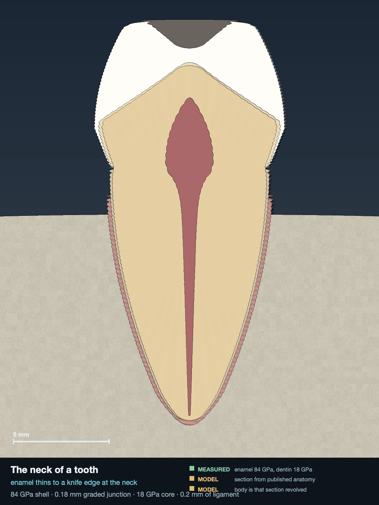

The first question was the wrong one. **"Does the crack arrest at 1000 N" has no answer** — at a fixed load, a crack in a bending member either never starts or runs to failure, because the material left ahead of it carries more as the crack grows. At 1000 N this tooth splits; at 500 N nothing cracks at all. Neither run says what the junction is worth.

Under a *rising* load it does. The first bond goes at **550 N** on the cusp incline and the crack reaches the dentino-enamel junction in the same rung — enamel offers it nothing on the way down. Then it stops, and stays stopped until **676 N**, where the first bond with dentin at both ends finally breaks. That gap is the whole result: an **arrest margin of 1.23×**, a 23% window of load in which the junction holds a crack that enamel could not. Dentin is both more compliant and stronger in tension, so its failure strain is nearly an order of magnitude larger — that *ratio* is the mechanism, not either number alone. Asserted as a rate over six seeded runs, and only at 0.10 mm: at 0.20 mm the junction band is thinner than one cell, every margin comes out at exactly 1.00, and the test is measuring the mesh.

The stress at the neck, meanwhile, **has no value at all, and that is the finding.** It reads 47.5, 68.6 and 101.7 MPa as the mesh halves — growing by the *same factor* each time, σ ∝ h^−0.55. That is the signature of a material-wedge singularity: enamel thins to nothing against cementum at the neck, and a stiff wedge into a softer material has unbounded elastic stress at its tip. There is no number there to find, at any mesh, ever. So the step reports the neck as a **ratio to the crown** and never as a value — while asserting separately that what *should* converge does (displacement settles 339 → 293 → 264 µm) and that the **location** converges even though the magnitude does not, landing within 0.35 mm of the CEJ every time.

The tooth is a triangular central-force spring lattice, which forces **ν = 1/3** by geometry — close to enamel's 0.30 and dentin's 0.31, and wrong for the ligament's 0.45, which is stated rather than hidden. Getting it to behave like a tooth took four things together, and removing any one brings the artefact back somewhere else: 0.2 mm of periodontal ligament at 50 MPa; an alveolar crest **1.5 mm below the CEJ rather than 6 mm** (the first version was a 13.5 mm cantilever, and this one number moved the peak more than the ligament did); a support that **fades in** over the millimetre below the crest, tapering the *bone shell* and not the ligament, since a tapered cushion just puts rigid bone against root; and a load that is the cusp facet's own normal rather than a typed direction.

That last one mattered more than it sounds. An oblique resultant on a flat cusp tip needs a friction coefficient near **1.0** to exist, and wet enamel on enamel is 0.1–0.4 — occlusal forces are oblique because the contact is on an *incline* and the force is normal to it. Put the load where it belongs and the answer splits: on the lingual incline the horizontal moment and the vertical eccentricity **add** and the neck carries 60.3 MPa against the crown's 31.4; on the buccal incline they **oppose**, cancelling about 45%, and the crown wins at 70.2 against 33.2. Same tooth, same cusp, same 1000 N. Whether grinding concentrates stress at the neck depends on where in the cycle you look — which is a much better account of why abfraction is contested than "limited evidence," and it is what the evidence bar says on that beat.

Two failures worth keeping. A crack can leave a cusp hanging by a **single node**, which is a hinge, and a central-force lattice resists it not at all: conjugate gradient then converges happily on a solution containing a **ten-kilometre displacement**, and the NaN strains that follow read as "nothing is overloaded," because NaN compares false against everything. The run reported itself *arrested*. Neither a bond count nor a connected-component test sees it — the fragment is connected. Displacement is what sees it. And the 60 µm of enamel at the neck is **below mesh resolution at every mesh this step can afford**, so what the lattice breaks there is junction band at 38 GPa; an Euler–Bernoulli check on the CEJ section puts the real enamel skin near 150 MPa at 1000 N, implying initiation nearer 250 N. Both numbers are reported. The thickness never set the stress — strain compatibility did. A knife edge at 4.7× the dentin's stress; the thinness only sets how little energy it takes to get through it. Code: [`step019_tooth/`](step019_tooth/)

### Step 20: Lower dental arch

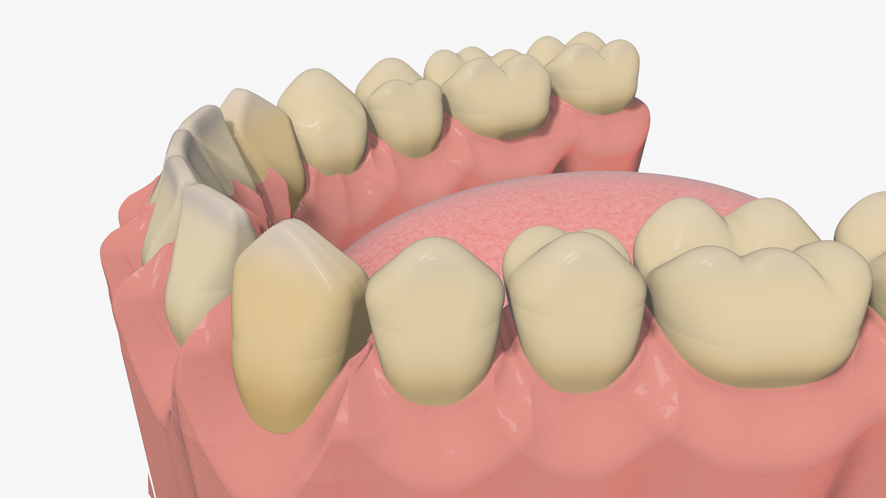

Back to where the project started: **one still frame, nothing but shape and light**, marched per pixel in Metal the way the step 3 ocean was. No animation, no physics, no labels. Every surface is a formula for the distance to it — a tooth is a rounded box that narrows at the neck with a height field of cusps for a top — and there are no meshes anywhere.

The numbers are from the clinic rather than from the eye. Fourteen teeth take their crown sizes from *Wheeler's Dental Anatomy*, and the arch is Hawley's 1905 construction: the front six on a circle whose radius is the combined width of one incisor, one lateral and one canine. That radius comes from the table, and it lands the canines **25 mm apart** — inside the published adult range — without being told to. The gums scallop because each tooth's cementoenamel junction curves, 3 mm under an incisor and 1 mm under a molar, and the gum follows it. Colour is measured CIELAB throughout: gingiva from a clinical study of healthy gums, each tooth type separately, and the incisal edge at its own value. **The canine really is darker and yellower than the incisors** in the data, and the render shows it.

Two pieces of optics carry the look. A tooth in a mouth is **wet**, so its crisp highlight comes from the saliva film — air to water, 2.0% — while the enamel beneath reflects only against water, 0.94%, a sixth of what a dry tooth would. And the biting edge goes **grey-blue** where the enamel is thin enough for the dark mouth behind to show through, read straight off the distance function: step inward from the surface and see how soon you come out.

The distance-function test earned its place. The first renders had streaks, and it found why: the teeth were **over-reporting distance 3.0×** and the gum 3.4×, so rays stepped through surfaces. Fixing it took three attempts, and two of them introduced discontinuities of their own — one read **60×**, from a slope correction that switched off abruptly — which the same test caught. Every surface now stays inside the 1.67× the ray allows. And one colour test was quietly wrong: it compared raw b\*, which falls as a surface darkens, so it was counting the gum's shadow on the neck as colour. It compares b\*/L\* now. 1920 × 1080 at 16 samples per pixel, 18 s on the M4. Code: [`step020_mouth/`](step020_mouth/)

### Step 21: Along the lower arch

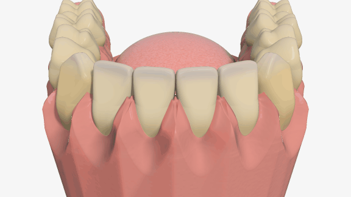

Step 20's arch with a camera that **travels**. It starts square in front of the gap between the two lower central incisors (#25 and #24) and glides back along the patient's left side until it faces the **wisdom tooth, #17** — then holds, and dissolves back to the start. Never a rewind. The first version stopped one tooth short, at #18, and ended on a rounded post of gum that didn't look right; the arch now has its third molars (#17 and #32), and the gum behind them rolls down as a mound, tested to only fall away behind the last tooth.

The interesting problem was a corner nobody could see in the still. Hawley's arch is a circle for the front six teeth and straight lines behind them, and aiming those lines so the first molars land 38 mm apart leaves a **20° kink in direction** where they meet the circle at the canine. A camera that follows the arch there jolts. Averaging the direction once was not enough — the test still measured a bend of 17 per mm — so the rail averages the arch *itself* over ±7 mm, worked out exactly, and then averages its heading again; the worst bend is now 0.27 per mm, against about 40 on the raw arch. Within 10 mm of each end it blends back onto the real teeth, so it still starts and ends exactly on the ones named.

Building it also caught an error in step 20: its comments had **left and right mirrored**. The renderer is right-handed, so seen from the front, +x lands on the viewer's left — the patient's *right*. The arch is an exact mirror image, so the still never showed it, but a camera sent to +x would have ended on #31. Step 20 was made to take its camera at run time — and, behind an option that is off for it, the wisdom teeth — without changing a pixel: its re-render hashes identically to the committed image, as does step 22's. The third molars' crown sizes are Wheeler's values but could not be checked against a reachable copy of the table, and the code says so. 544 × 306 at 20 fps, 201 frames, 9.5 MB — every pixel changes every frame when the camera moves, so the size was chosen after measuring ten frames. Code: [`step021_arch_pan/`](step021_arch_pan/)

### Step 22: Brush meets tooth

Step 20's still, untouched, with a round oscillating toothbrush head pressed against the cheek side of **#21**, the patient's left lower first premolar, right at the gumline where brushing is aimed. Modelled on Russell's own brush: an **11.5 mm** head with a rim of sixteen 1.5 mm tufts in dark and light blue, coloured from his photographs. The first render used Oral-B's own "approximately 13mm" for its classic round head and read too big beside a 7 mm premolar; no maker publishes the smaller Precision Clean's size, so it is a little under the classic figure and marked as an estimate, with every part of the head scaled together so it keeps the photographed proportions.

The point of the step is that **contact comes from the geometry, not the eye**. Each tuft is fired along its own axis at step 20's distance function and stopped where it meets the tooth or the gum, to about a micron; the head is pressed in until the tuft with furthest to go just arrives at its full 7.1 mm, and every other tuft is as much shorter as the surface in front of it is nearer — 3.97 mm to 7.08 mm. The ones pressed hardest splay. The largest gap between any tuft tip and a surface is 0.00000 mm, and 78,125 points inside the tufts confirm none passes through. Lift the brush a millimetre, or push it a millimetre in, and a test fails.

Step 20 gained an optional hook for extra scenery and changed not a pixel — its render still hashes identically. Two compromises are visible: at this camera the head still cannot fit below the gumline, so the frame cuts it off and hides its white centre tufts; and the neck leaves through the right edge, where a real one would come from between the lips. Code: [`step022_brush/`](step022_brush/)

### Step 23: Secretory diarrhea (cholera-type)

The same stretch of gut twice — the end of the small intestine, the valve, the start of the colon, and a shortened run to the rectum — **normal above, cholera below**. The villi stop at the valve, because the colon's lining is flat; a test reads 600,000 points past it and finds none inside a villus.

The mechanism is drawn in its real order and along its real routes. The toxin opens the CFTR channel and **chloride leaves through the cells**, from the crypts — not the villus tips, which go on absorbing (and that is why oral rehydration works). The lumen goes negative, and **sodium follows between the cells**; water follows both. A close-up of one crypt wall shows the two routes, and a test checks that every chloride stays inside a cell and every sodium outside one, and that each wave finishes before the next begins.

The particles are counted, not sprinkled. The lumen holds **135 : 100 : 15 : 45** sodium, chloride, potassium and bicarbonate — adult cholera stool, from the WHO tables — which gives an osmotic gap of −10: under 50, the laboratory signature of a secretory diarrhea. And the colon is drawn honestly. It is not idle, it is **overwhelmed**: working near its ceiling of about 5 L a day (Debongnie & Phillips 1978) while severe cholera can deliver more than a litre an hour. So the cholera colon returns *more* water than the normal one — 32 arrows a loop against 9 — and still falls hopelessly behind. The squeezing wave contracts behind the contents and relaxes ahead of them, as Bayliss and Starling described in 1899. 1280 × 960, 80 frames, 8.9 MB. Code: [`step023_diarrhea/`](step023_diarrhea/)

### Step 24: Lactose intolerance (osmotic diarrhea)

Step 23's gut, the same frame for frame, carrying a diarrhea that works the **opposite way**. Nothing is pumped out of the wall. After two glasses of milk — about 24 g of lactose, where the NIH consensus puts symptoms becoming appreciable — the missing enzyme leaves the sugar in the gut, and the sugar holds water there **by osmosis alone**. A test checks that no chloride and no ion of any kind leads the water in; that absence is the whole visible difference from cholera.

Above, lactase — drawn as a simple gold marker on the villus tips, and deliberately *not* step 17's molecule, which is the bacterial cousin; the human enzyme is a different protein — cuts each lactose into glucose and galactose, and both go in through SGLT1 with two sodium ions each. Below, the lactose passes untouched to the colon, where each one is taken up by a bacterium that gives off gas and short-chain fatty acids; the colon takes about half those acids back and some water with them — not enough.

What reaches the rectum is counted, as in step 23, and it tells the two diarrheas apart: sodium 33 and potassium 30 mmol/L, from measured carbohydrate-malabsorption stool (Hammer et al., *J Clin Invest* 1989), give an **osmotic gap of 164** — over 125, the laboratory signature of an osmotic diarrhea, where step 23's came out at −10. The stool is acidic, pH about 4.5. Two honesties are on the frame: those stool numbers are from lactulose, since no measured table for lactose turned up, and at 24 g the diarrhea is usually mild — bacteria absorb much of a small dose — so the render shows the mechanism, not a severity. It is not an allergy, and the often-quoted "68% of adults" figure appears nowhere: that paper was retracted in 2024. Code: [`step024_lactose/`](step024_lactose/)

### Step 25: A bean flower pollinates itself

A white *Phaseolus vulgaris* bud, cut open at the moment its own pollen reaches its own stigma — and it is a **bud** on purpose. In beans the anthers split the evening **before the flower opens** (McGregor, USDA Handbook 496), so by the time a bean flower opens it has usually fertilized itself already. The pollination happens inside a flower that has not yet opened.

The hero is the shape nobody expects: the **keel coils** — "spirally coiled through 1–5 turns", in the Flora of Tropical East Africa — and the style coils inside it, 639° here against the 360° the floras require. A test follows the style all the way round and checks it never touches the keel wall. Around the stigma sit the ten stamens in the legumes' own **9 + 1** arrangement, nine fused into a sheath around the ovary and one free, and a test probes the gaps to prove it. Pollen is **triporate and 41–50 µm across** (PalDat), which at true scale is under four pixels — so the flower is drawn true and a ×10.3 inset shows the grains on the stigma's brush of hairs and one of them sending its tube down to one of six ovules. The tube is traced through 428 points and never leaves the pistil.

Where the evidence is weaker it says so: bud-selfing is documented for cultivated beans and the tepary bean, but a wild variety is receptive before its anthers open and only partly self-compatible, so the honest phrase is "mostly self-pollinated" — natural crossing runs 0–10%. The pod behind, the same ovary about fourteen days on, is drawn as a soft blur, and reads more as a green smudge than a pod. Code: [`step025_bean/`](step025_bean/)

### Step 26: An ant tastes sugar

The brief was "an ant smelling sucrose", and the render corrects it on the page: **sucrose has no vapour to smell.** At room temperature its vapour pressure is effectively zero — heated, it melts and decomposes before it could ever boil off — so no sugar reaches an ant through the air. Ants find sugar by **touch**: taste hairs on their antenna tips, mouthparts and feet.

So the picture is three views at three scales, each with a scale bar that is true everywhere in its frame. A *Lasius niger* worker, 4.0 mm long with a head sized from Seifert's measurements, rests one antenna on a grain of sugar — **12 antennal segments**, as every worker ant has, six legs on the middle body section, one waist scale — and the contact is measured, not placed: the tip sits 0.0000 mm from the crystal. The grains are cut from sucrose's real monoclinic crystal cell. The first inset shows why taste and smell are different senses you can see: a **taste hair has one pore, at its tip**, and must touch; a **smell hair has hundreds in its wall**, and samples the air. The second shows the molecule itself, from the same crystal structure step 18 used, with its hydrogens added in idealised geometry.

The distance-function test caught two shapes that were quietly lying — a waist drawn as a thin ellipsoid over-reported distance 2.7×, and the smell hair's pores 1.7× — and both were rebuilt as exact shapes. Where the textbook is tidier than the ant, the code says so: ant smell hairs can carry a small dimple at the tip too. And the sugar grains still read a little like ice cubes. Code: [`step026_ant/`](step026_ant/)

### Step 27: One neuron

The most minimal render in the series: one nerve cell, the four parts that make it a neuron, and a scale bar. A **50 µm** cell body, soft enough to show its nucleus; dendrites that **taper** at every fork; **one axon** that doesn't, 7 µm all the way; a few end knobs; and a break in the axon, because a real motor axon can run about a metre — some twenty thousand cell-body widths.

It has **twelve** dendrites rather than the "few" a textbook sketch shows, because measured cat motor neurons average twelve (range 5–20), and the sizes follow the measurements rather than the sketch. Where it simplifies, it says so: the dendrites are drawn several times shorter than their real millimetre so the tree doesn't swallow the cell; the nucleus size comes from a different neuron, since no motor-neuron value turned up; the end knobs are schematic; and the green is a choice — real neurons are colourless unless stained. The camera is straight-on so the scale bar is true anywhere in the frame. Code: [`step027_neuron/`](step027_neuron/)

### Step 31: One neuron fires

Step 27's neuron, every pixel of it at rest identical to the still, with **one nerve impulse** travelling out. It starts where impulses really start — the axon's initial segment, just past the cone where it leaves the cell body (Coombs, Curtis & Eccles showed this in cat motor neurons in 1957) — glides out along the axon, disappears into the break and comes out the far side, and lights the four end knobs. Then the cell rests, and the next impulse follows: a loop that only ever runs forward.

The caption carries the real numbers. The speed is derived rather than typed: about 6 m/s per micrometre of fibre diameter (Hursh 1939) on the 7 µm axon and its insulation gives **70 m/s**, inside the 50–100 usually quoted, so the render is slowed about **700,000×**. And it is honest about what it simplifies: real motor axons are insulated with myelin and the impulse *jumps* from gap to gap, but step 27 left the myelin out, so here it glides; the metre hidden in the break would really take 14 ms — nearly three hours at this slow-down — and is cut to under a second. Tests hold it to the physiology: it starts at the initial segment, moves only outward, and never lights a dendrite; start it in a dendrite or run it backwards and the suite fails. Full HD, 8 s, just 0.39 MB — only a short stretch of thin axon changes in any frame. Code: [`step031_neuron_firing/`](step031_neuron_firing/)

### Step 32: An ant tastes table salt

Step 26's scene with the sugar swapped for **table salt** — and the same lesson, because salt has no smell either: sodium chloride is not volatile, so the smell hair's many pores have nothing to catch and a test fails if any volatile reaches it. The ant tastes it by touch. The grains are halite's true shape, near-perfect cubes, and the molecular inset shows the rock-salt lattice itself, sodium and chloride alternating on a cubic grid, with ions leaving the crystal face into the moisture film on the antenna tip. The ions keep step 23's colours — sodium violet, chloride green — and the order of their real ionic radii. A cosmetic flaw from step 26 is fixed here too: the antenna's base segment is now the reddish brown its source describes, not a pale stub. Code: [`step032_ant_salt/`](step032_ant_salt/)
