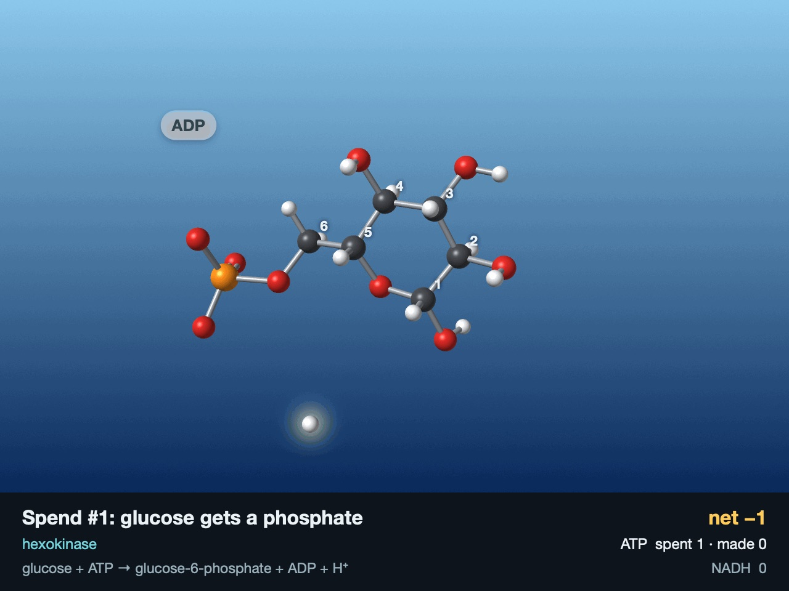
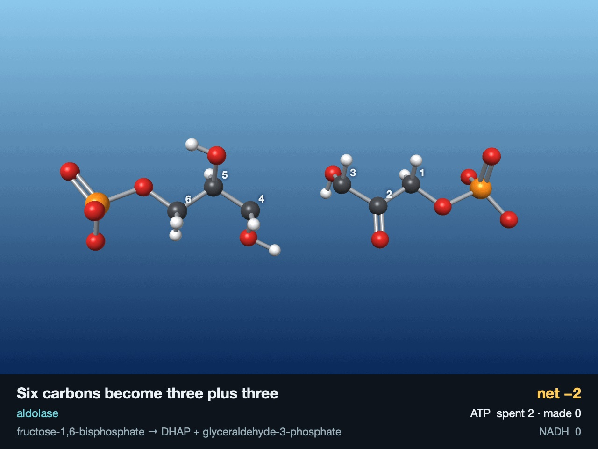
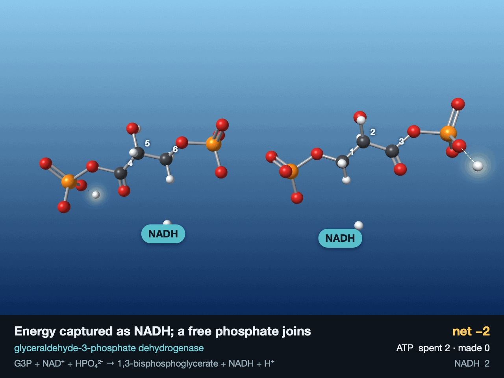
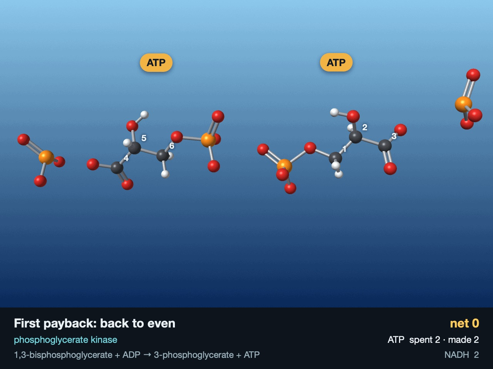
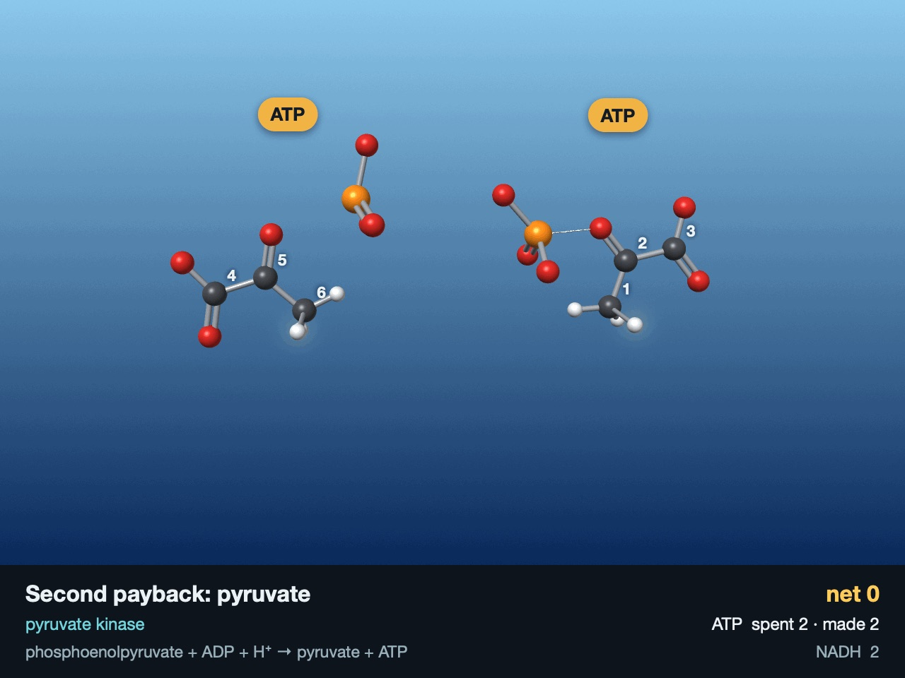
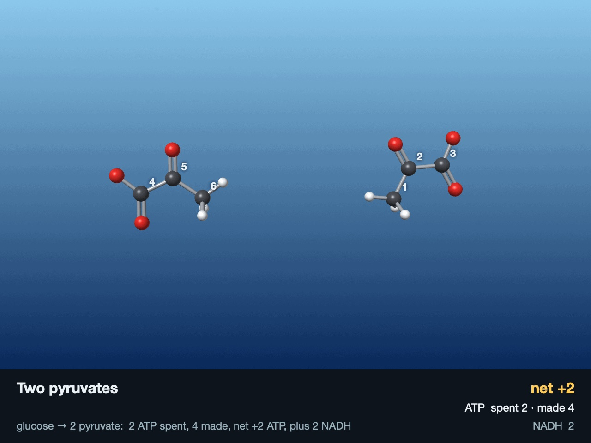

# Step 7a: Glycolysis: spend two, earn four

Six moments from the two loops.

| | |
|---|---|
|  |  |
| **Spend, hexokinase:** ATP → ADP, H⁺ leaves | **Spend, aldolase:** C3–C4 breaks |
|  |  |
| **Payoff, GAPDH:** two NADH | **Payoff, phosphoglycerate kinase:** back to even |
|  |  |
| **Payoff, pyruvate kinase:** H⁺ arrives | **Two pyruvates:** net +2 ATP |

`make run` renders both GIFs, `make test` runs the Swift tests, `make check` checks the chemistry.
